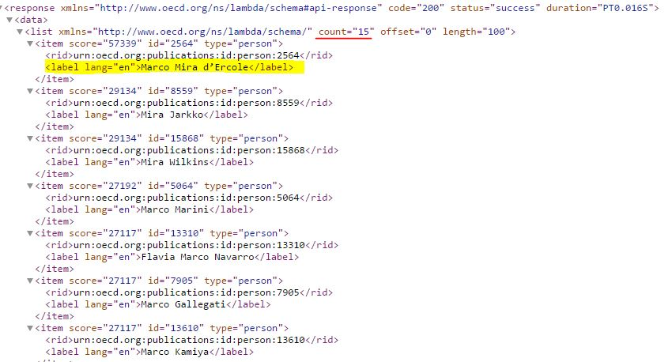

Retrieve information from the API
================================

You can retrieve a lot of information via the API. 

For the details, you will see many methods documented on the 
`Home page of the API <http://vs-pac-xml-4.main.oecd.org:10001>`_

In this user guide we will give you the URL links to some of the most common requests we have received from users.
They may be accessible via the reports tab one day, but at the moment you can use the following links.

Retrieve the taxonomies
------------------------
To retrieve the compelte list of available taxonomies, use this URL :  

http://vs-pac-xml-4.main.oecd.org:10001/v1/taxonomy

to have the detail of each one, simply add its name to the URL.
For example if you wich to know which values are possible for the taxonomy availability, just use the link:

http://vs-pac-xml-4.main.oecd.org:10001/v1/taxonomy/availability

Generate Enumerations file for the loading.xsd schema
------------------------------------------------------

Use this URL : http://vs-pac-xml-4.main.oecd.org:10001/v1/taxonomy/igo,availability,country,form,language,medium,organization,periodicity,person,region,theme?format=xsd

as you can see it is composed in the following way :

* first part URL of the API ``http://vs-pac-xml-4.main.oecd.org:10001/v1``
* then you choose taxonomies ``/taxonomy/``
* then you list which taxonomies interest you ``igo,availability,country,form,language,medium,organization,periodicity,person,region,theme``
* and finally you precise which format you need (in this case xsd schema) ``?format=xsd``

Useful Parameters
-----------------
Parameters are addes with a ``?``

* ``term`` = to search for a chain of caracters

* ``type`` = to search for a type (for example catalogueType) like ``summary``, ``indicator``, ``indicatorGroup``... )

* ``sort`` = to sort the results, available orders are

	* ``title-up`` : titles in alphabetical order
	* ``title-down`` : titles in opposite alphabetical order
	* ``date-up`` : publibation date, oldest first
	* ``date-down`` : publibation date, most recent firs

	
Example : How to search if an author already exists in the persons taxonomy
----------------------------------------------------------------------------

If you are looking for Marco Mira d'Ercole,

You will have to search the persons taxonomy : http://vs-pac-xml-4.main.oecd.org:10001/v1/taxonomy/person

and add for example the parameter ?term=Marco Mira

the resulting URL will be

`http://vs-pac-xml-4.main.oecd.org:10001/v1/taxonomy/person?term=Marco Mira <http://vs-pac-xml-4.main.oecd.org:10001/v1/taxonomy/person?term=Marco%20Mira>`_

which will give you 15 results, the first on is the one you are looking for :

