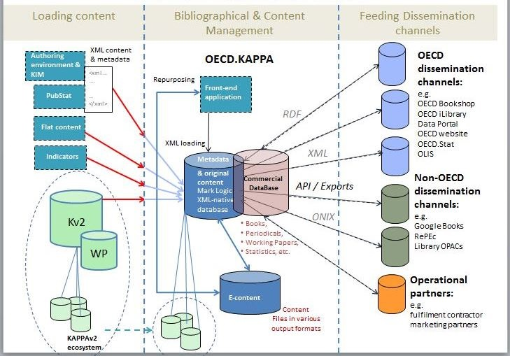

======
About 
======

What is Kappa?
---------------------

Kappa is a new application under development intended to replace the current `OECD Publications database <http://pac-apps.oecd.org/kappa>`_ , 
which manages OECD publication metadata for the past 10 years, and enables metadata driven dissemination of OECD publications.
While the current Publications database is only a catalogue of publishing metadata for roughly 200.000 OECD publications and related content 
(books, chapters, tables, graphs, multilingual summaries, journals, articles, statistical data, and working papers), Kappa will play the role 
of both metadata and content repository with the potential to expand to any OECD published content beyond OECD Publications such as press releases,
legal acts, speeches and brochures.

Metadata and Content Repository
---------------------------------

Publishing metadata are composed of core metadata describing content such as titles and abstracts, including purely bibliographic metadata such as 
an ISBN for a book and its authorship (physical and institutional authors, editors, publishers, etc.). They also include specific metadata required to 
disseminate publications such as Digital Object Identifier (DOI), and metadata to manage the lifecycle of published content, enable its dissemination 
and monitor its usage (status, date of publication, etc.).
The content corresponds to the publishable content created by an author. It is the reference content and corresponds to the final manuscript of a 
publication which is ready for publishing and dissemination.
Both content and metadata will be managed in Kappa and made accessible to end-users via web interfaces.
In addition to manage published content, Kappa facilitates its dissemination.

When and how content is submitted to Kappa
----------------------------------------------------

Kappa will store both structured and unstructured content.
Structured content refers to content has been broken down and classified against a descriptive model or template. The publication or document XML based 
content created with the new Authoring Environment (OECD.Author) or the table XML based content created out of OECD.Stat are examples of structured content.
Unstructured content refers for example to composite or proprietary file such as PDF or image files.
Unstructured and structured content will be loaded in Kappa in a manual or automated manner depending on need.
Unstructured content loaded into Kappa will be transformed into structured content, but will not be structured with the same level of granularity 
(e.g., chapters, tables, graphs, bibliography) as content originally created with an authoring tool like the Authoring Environment.

Managing content in Kappa
-------------------------------------

As content is loaded into Kappa, a metadata record describing this publishable content is created: core metadata existing in the content is created 
automatically in the metadata repository, additional metadata can be either auto-generated based on business rules or added manually to enrich the metadata record.
Each metadata record will be described at three levels corresponding to the Functional Requirement for Bibliographic Records standard 
(`FRBR <https://en.wikipedia.org/wiki/Functional_Requirements_for_Bibliographic_Records>`_):

* The work: the intellectual and publishable content (e.g. 'Factbook 2012' edition)
* The expression: the specific language versions or form of the intellectual content (e.g. 'Factbook 2012 (English version)', 'Panorama de la société 2012 (French version)')
* The manifestation: the physical objects corresponding to a published content and subject to dissemination (e.g. all available format or media versions including PDF, Paper, HTML, ePub, XLS, etc.).

This hierarchy of information combined with systematic metadata on granular content (such as chapters, tables, and graphs belonging to a parent content) will generate many 
links around a single Kappa record of published content, including hierarchical relationships (inherent in the work, expression, manifestation hierarchy), and parent-child 
links (e.g. chapter of, part of, summary of).

In addition, other intellectual or editorial links (subject to an intellectual decision such as 'further reading`` or 'is related to`` type of links) will be managed and stored
in Kappa.

All this together (content, metadata and links) will generate a 'tree' of information managed and stored in Kappa for each unique piece of content.
According to metadata-driven business rules, production systems will be able to recuperate XML content to generate its different media versions.

Disseminating and re-purposing Kappa content
--------------------------------------------------

Ultimately, the media version of content will be ready for dissemination on publishing channels (such as but not limited to `OECD iLibrary <http://www.oecd-ilibrary.org>`_ , 
`OECD Online Bookshop <http://www.oecdbookshop.org>`_, or `RePEc <http://econpapers.repec.org/paper/defaultO.htm#O>`_) 
according to metadata-driven dissemination rules.
Dissemination will be possible in 'push' mode (export to third parties) if required, otherwise mainly in 'pull' (self service) mode. The pull mode will be based on web services 
exposing both content and metadata.
XML content stored in Kappa will remain available for re-purposing. New re-purposed content will also follow the process described above.

Kappa architecture
------------------------
Kappa is a native XML database based on MarkLogic. Content will be stored as XML content in Kappa while metadata and links will be stored in RDF format adapted to manage linked data and 
the information tree as explained above. This architecture is aligned with the XML based Authoring Environment.

Global Functional vision
-------------------------

Roll out
---------
Kappa is implemented in a phasing approach, as the current `OECD Publications database <http://pac-apps.oecd.org/kappa>`_  application needs to continue functioning in parallel. The phasing approach intends to 
move content into Kappa, and release Kappa in production sequentially, content type by content type.
The two first content types released in Kappa were the multilingual summaries (last quarter of 2013) and then data indicators (second quarter of 2014).
Each content type released in Kappa will be fully removed from the current `OECD Publications database <http://pac-apps.oecd.org/kappa>`_  application once it has been migrated to Kappa. Kappa as a minimum 
viable product is estimated to be completed by end 2016.

Benefits of Kappa for the OECD
----------------------------------------

Kappa will provide:

* A more powerful and standardized metadata model to manage OECD current and future published content.
* Increased ability to publish new types of editorial products.
* Improved access to published content internally.
* Increased metadata quality and consistency,
* Reduced metadata production (as metadata production will be partially automated).
* Industrialized dissemination of published content and metadata, and improved accessibility to them externally.
* Quicker time to market (by improving the processes described above).

Built on standards, using state of the art and open technologies, Kappa brings innovation and opportunity for better management of knowledge and information within the Organisation: 
it is a key enabler for making OECD content more open and accessible.

