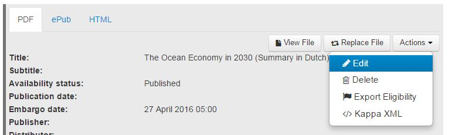
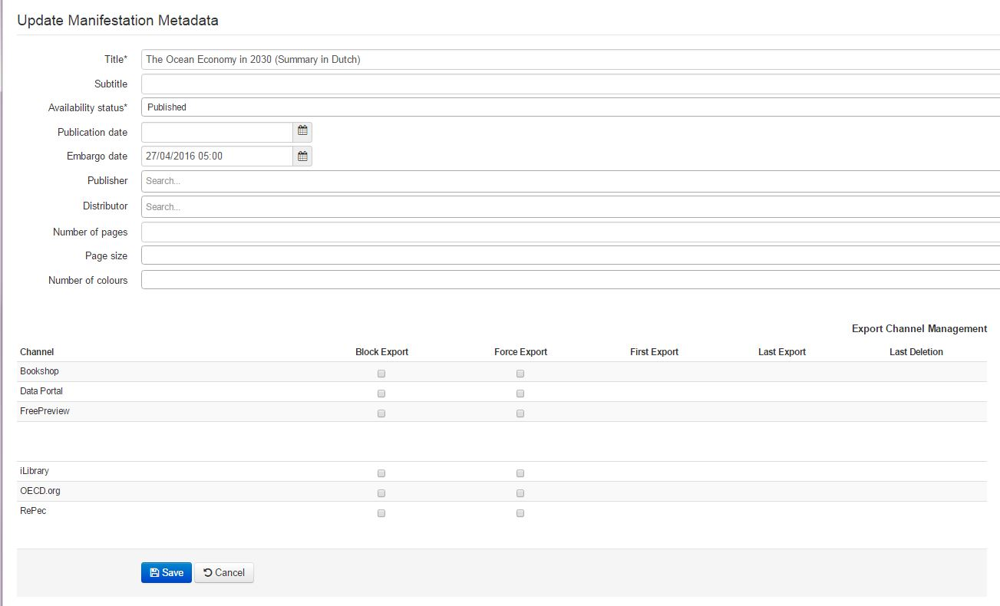
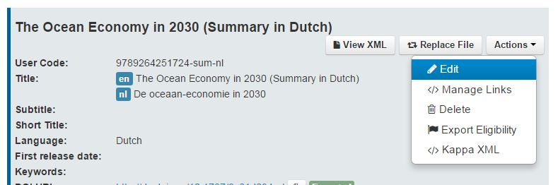
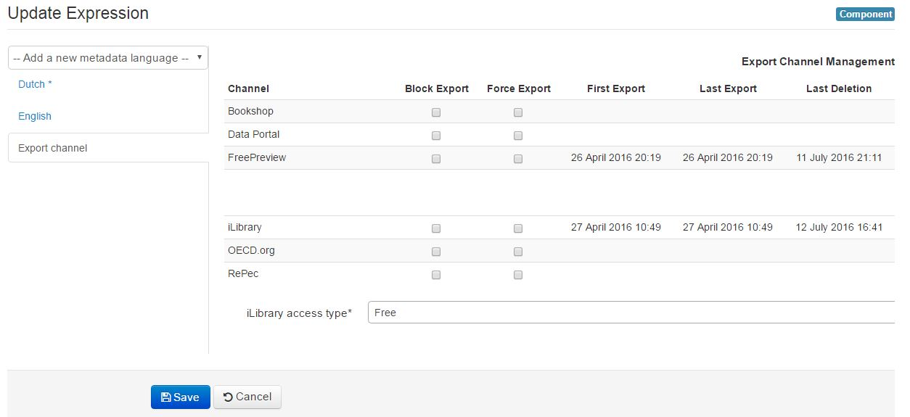

Block or force an Export
=========================

You can either block the export of a format (for example the PDF only, while you want to keep exporting the HTML) 
or block all formats of a publication.
In the first case you apply the block at manifestation level, in the second you apply it at expression level.

Block a manifestation
-------------------------

You can block the export for any item at MANIFESTATION level via 'Edit Manifestation'

 

If the MANIFESTATION is blocked for export

* It has a notice 'Blocked'
* It remains blocked until it is unblocked manually
* It is removed from the channel if it has already been exported before

You can unblock the export for any item at MANIFESTATION level via 'Edit Manifestation'

Once you have unblocked it, the MANIFESTATION is exported (of course only if eligible criteria are met)

Block an expression
-----------------------

You can block the export for any item at EXPRESSION level via 'Edit Expression'

 

all MANIFESTATIONs belonging to the EXPRESSION will then be blocked for export

* they are removed from the channel if it has already been exported before
* they keep their individual block/unblock status
* they have a notice 'Blocked by Parent' regardless of the MANIFESTATION block/unblock status
* New MANIFESTATIONS added to the EXPRESSION are blocked for export
* EXPRESSION remains blocked until it is unblocked manually

You can unblock the export for any item at EXPRESSION level via 'Edit Expression'

Once you have unblocked, MANIFESTATIONS belonging to the EXPRESSION are exported depending on their MANIFESTATION block/unblock status

Force a manifestation
-------------------------

You can force the export for any item at MANIFESTATION level via 'Edit Manifestation, Force Export'

The MANIFESTATION is exported

* A blocked MANIFESTATION will not be exported until unblocked (e.g. block supersedes force)

Force an expression
-----------------------

You can force the export for any item at EXPRESSION level via 'Edit Expression, Force Export'

MANIFESTATION belonging to the EXPRESSION is exported

* A blocked MANIFESTATION belonging to the EXPRESSION will not be exported until the MANIFESTATION is unblocked (block supersedes force)
* A MANIFESTATION belonging to the blocked EXPRESSION will not be exported until the EXPRESSION is unblocked (block supersedes force)
* For Indicator Group 'Force' functionalities are not applicable

Export status information
--------------------------

Export status information is displayed for all work types at EXPRESSION for the iLibrary

* First export date and time
* Last export date and time
* Last deletion data and time

.. image:: images/ExportData.JPG