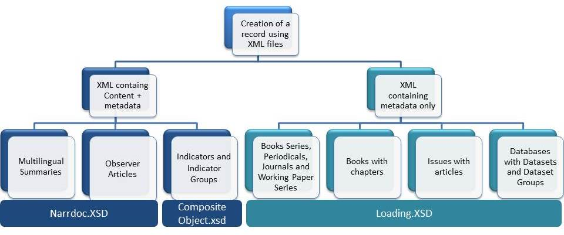

Creation of records loading XML files
==========================================

Kappa records can be created with different kinds of XML files : either XML containing only metadata, or XML containing metadata and content.

Each model is applicable to a different type of published object

Creation from Content XML file
-------------------------------

The following objects are created via extraction of metadata from the content XML. 

Follow the links the read the corresponding processes in detail :

	* :doc:`Multilingual summaries </MultilingualSummaries>` are created extracting the necessary metadata from a narrdoc file (metadata and content).
	* :doc:`Observer articles </OECDObserverArticles>` are loaded into Kappa automatically via the editorial system. The XML is a narrdoc(metadata and content).
	* :doc:`Indicators and Indicator Groups</IndicatorsIndicatorGroups>` are loaded into Kappa automatically via the editorial system. The XML follows a schema called Composite Object.

Creation from Metadata XML
-------------------------------

The schema Loading.xsd allows the user to create a record in Kappa with an XML containing all the metadata.

At loading, the XML is analysed, some metadata are extracted and others are derived following the inheritance rules.

Details the mapping schema to metadata can be found here: 

	* :doc:`Series </CreationXMLMetadata_Series>`
	* :doc:`Books </CreationXMLMetadata_Book>`
	* :doc:`Chapters and Articles </CreationXMLMetadata_ChapterArticle>`
	* :doc:`Databases, Datasets and Dataset Groups </CreationXMLMetadata_Data>`

