Databases, datasets and dataset groups
=======================================

At a glance
-----------

* When Data objects are *created* in Kappa, their status is set to *Not Yet Available*
* *Status* can be edited after creation 
* Exports to iLibrary can be *blocked* as needed
* To ensure data objects in Kappa are eligible for iLibrary export, see the latest document in redmine with the export rules
* To ensure Branded Views in OECD.Stat work as expected, configuration rules should be followed (see below)

Search and Filter
-----------------

To easily search for data objects in Kappa, it's useful to know their *Work and Catalogue types*. 

.. image:: images/data-types.PNG

This allows to make better use of the *facets in the UI*:

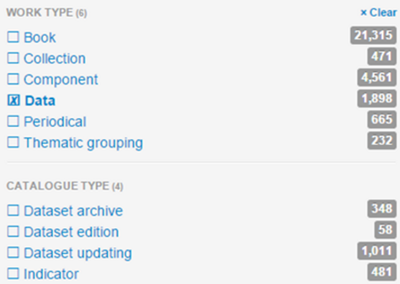

Create new records
-------------------

To start the creation of a data object:

* go to the ``Create`` menu
* select the ``Using form`` option

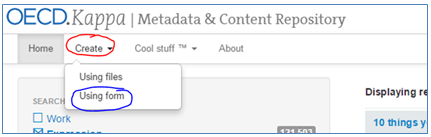

* choose the relevant form to create a new Dataset, Dataset Group or Database

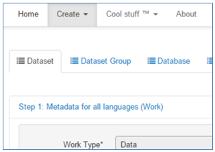

**Step 1**

The first step is to define all metadata at the Work level

* As a convention, the title of the Work should be in EN
* Set the metadata fields that are relevant to the object you're creating 
* Only some will be mandatory and some may be non-editable

.. tip::  To add a keyword, type the word or phrase, then hit Enter

**Step 2**

The second step is to define metadata for one or more Expressions 

* Set at least the mandatory metadata fields 
* For at least one expression or language

.. note:: It is possible to add expressions later via the UI once the object has been created 

* To create another expression, click the ``Add new Language`` button at the bottom of the Step 2 form 
* Fill the form that appears (or if you change your mind, click on ``Remove this Language``)

.. note:: At present, you **must also create the Online manifestation if one exists**. It is currently **NOT possible 
to add manifestations later** via the UI once the object has been created

* Save to create the object and its Work, Expression(s) and Manifestation(s)

.. tip::  The objects are created with a status of ``Not yet available`` You can edit the status and export channel options later

Any missing configuration items will be displayed at the end of the form when you Save, e.g. 

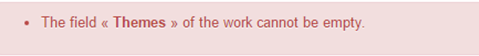

You will be given the links to the Work, Expression(s) and Manifestation(s) which are created, e.g. 

.. image:: images/Created.PNG

Update records
----------------

Edit metadata and links by clicking on the *Actions button* at the relevant level of the record to edit:

* Edit *metadata* at the Work, Expression and/or Manifestation level by clicking on the *Edit* submenu
* Edit *links* at the Work or Manifestation level via the *Manage links* submenu
* Manage *export channels* at the Manifestation level via the *Edit* submenu

**Edit metadata**

at work level .. image:: images/editdata.PNG

at expression level .. image:: images/editdataexpr.PNG

**Edit links**

* Links are defined by users **in one direction only**
* The **inverse link is deduced by Kappa** (taking into account who the parent and the target are)
* For instance, between datasets and their archive: the xlink ``is Archive Of`` is expressed from the Archive
to the Dataset, and the reverse link (``is [xlink type] of``) is deduced.
* You can edit the order of links within the same link type, otherwise, links of type ``Continues``
are listed first in the UI, then ``Default child``, then ``Includes``

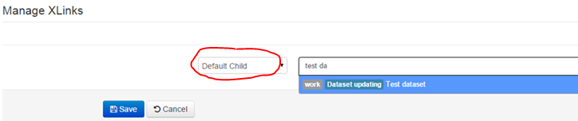

.. tip::  Select the link type first

* Start typing to *search for the object* to link to select the relevant object to add the link 
* Add more links as needed
* Save to create all links

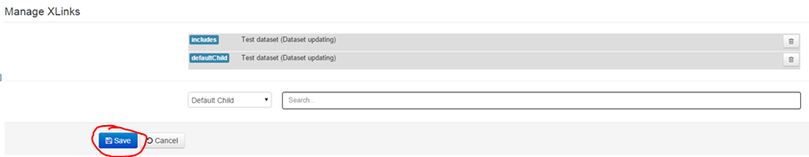

**Add a new expression to an existing object**

It is possible to add a new exrpession to an already created object via the UI. 
To to this, click on the ``Actions`` button on Work level and select ``Add new Expression``

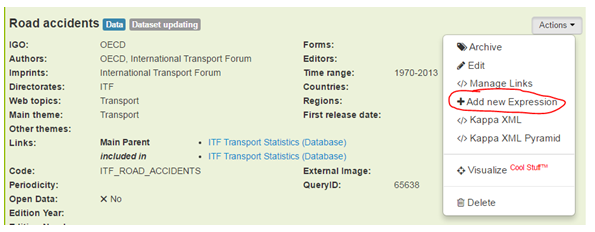

**Some rules**

* A database or database group **must have a default child** and a dataset must have a main parent. This is necessary 
for a correct display in both iLibrary and BV 
* Stand-alone datasets are no longer supported
* To configure a *dataset preview URL*: 
	* define the query in OECD.Stat
	* add the *QueryID number only* to Kappa (at Work level) 
	* the URL is generated automatically (at Manifestation level)

Archive Datasets
--------------------

* Both Editions and Updating datasets can be archived
* Each operation caters for a different use case:
	* A dataset edition is archived when a new (version of the) dataset is made available by the author 
	* Archiving an updating dataset implies taking a snapshot of a continuously changing dataset
* When a dataset edition is archived, the current record is updated by Kappa to become a dataset archive 
and a record is created for the new dataset edition, if the user selects to do so
* When an updating dataset is archived, the information on the record is used to create a new dataset archive. 
An edition year and year number must be added to the archive by the user.
* A record can be archived from the Work or Expression level
	* Archiving the Work will create a dataset archive record for each Expression 
	* Archiving the Expression will create a dataset archive record for that language, only

**Archiving Dataset Editions: Example**

Archiving at the Work level: 

* The current record is updated to dataset archive 
* All Expressions are archived 
* A record is created for the new dataset edition, if the user selects to do so
* An Edition Year and Number are proposed (based on the current year and month). These are added to the title 
of the new dataset edition. Users can change these as necessary.

Edition Archive example: OECD Factbook (Edition 2004) (http://kappa.oecd.org/v3/Expression/Details/g2g5582b) 

.. image:: images/ArchiveEdition.png

**Archiving Updating Datasets: Example**

Archiving at the Expression level: 

* A new archive record is created based on the original
* Only the selected Expression is archived 
* No Manifestation is created

.. note:: today we only create EN archives for updating datasets

* An Edition Year and Number are proposed (based on the current year and month). Users can change these as necessary. 

Updating Archive example: Main Economic Indicators - complete database (Edition 2015/8) (http://kappa.oecd.org/v3/Expression/Details/77bbccc2)

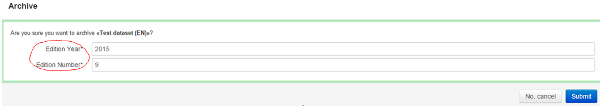

Dataset Archive files
---------------------

Snapshots of updating datasets are offered in iLibrary in the form of downloadable CSV (zipped) files.

These files must be loaded to Kappa for storage and distribution.

Using defined file name syntax, Kappa can:

* Identify the relevant archive record
* Create a Manifestation of format Dataset Archive 
	* Note the status is set to Not Yet Available by default
* Attach the file to the record
* Export the file as specified in the export channel settings
	* If the status is set to Available

**Attaching an Archive file to a Dataset record**

* Drop the csv.zip file in this hot folder
* Kappa picks files up files in that folder at regular intervals
* If the process is successful, log files are created in the ``result`` subfolder and an email sent to PAC OIF
* Otherwise, an error message sent to PAC OIF and the file placed in the ``tmp`` subfolder
* The file name must follow a defined syntax:
	* [OECD.Stat code]-[Edition Year]-[Edition Number]-[Expression Lang]-[YYYYMMDD]T[HHMM].csv.zip
	* e.g. **MEI-2015-8**-EN-20150818T1400-csv.zip .. image:: images/MEIexample.png
* The file will be created with a status ``available`` and will be exported to iLibrary in the next export delivery, you will 
be able to see it online the following day. Sould you wish not to export it, remember to change the availability status via 
the interface, at manifestation level.

Configuration rules for OECD.Stat Branded Views
------------------------------------------------

Some configuration rules must be followed for OECD.Stat Branded Views to work as expected:

* Expressions and Manifestations should be created **in EN and FR**
* Datasets **must not** have more than one Available manifestation
* A OECD.Stat **Code** must *only* be defined for datasets that have an Online manifestation, i.e. an actual dataset in OECD.Stat
* An **archive of an updating dataset** should only have one Available format (``Dataset Archive``) for its EN manifestation. 
No other manifestations should be Available in any other language, if they exist.
* A database or database group **must have a default child** (the default child is the dataset that will open by default in 
OECD.Stat when the user clicks the ``Data`` button on OECD iLibrary)
* A dataset **must have a main parent**
* For OECD.Stat, the same default dataset must be applied in EN and FR.
* A dataset can have multiple FTIs (that is, multiple manifestations in Kappa), but the BV will display only one FTI link, 
defaulting to the online version if available

Model
-----

**Databases** have: 

* **One** work and usually *two* expressions (EN and FR)
* **One** manifestation at the moment (iLibrary page ). The *ISSN* is at this level.

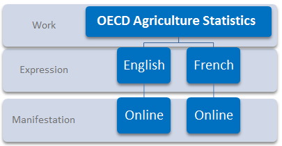

**Dataset groups** have: 

* **One** work and usually **two** expressions (EN and FR). Their **DOI** is at the expression level.
* *No manifestation* as they currently have no pages of their own. 

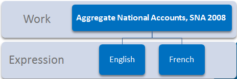

*Datasets* have: 

* **One** work and should have **two** expressions (EN and FR)
* **One** available manifestation only.  
Currently all the formats listed below are supported. Note the Archive format is created automatically when csv.zip files are 
attached to Archive datasets.

.. image:: images/Dataset_Model.PNG

*Dataset examples*

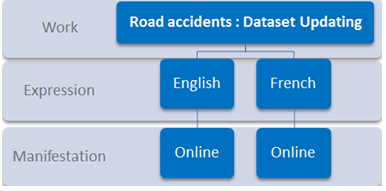

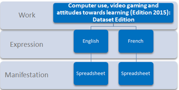
  
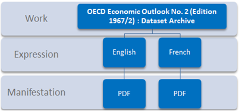

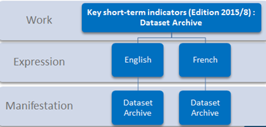

