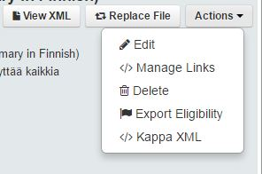

Expression panel
================

The panel dedicated to expression metadata is placed on the top right part of the screen.

All the metadata applicable to all languages and all format is available at this level.

Through the Actions menu the following possibilities are available

View XML
----------

When you click on view XML you will be able to retriev the XML used to create the record. 
This will be either the narrdoc XML file or the metadata XML file. For more information, pleaser refer to :doc:`CreateUsingFiles` 

Edit
-----

The edit function, not only allows you to change some metadata, but also to view some metadata fields 
which are not shown directly on the first interface.

Manage links
--------------

Through the manage links action you can edit or add all the links allowed at work level (see :doc:`Links` for details)

**Internal Links**

.. image:: images/ManageLinksInternal.JPG

**External Links**

External links , need a label and a URL

.. image:: images/ManageLinksExternal.JPG

.. note:: The links are checked against the taxonomy, you will not be able to enter invalid links, only the allowed for the level and the type of object

Delete
-------

The delete function allows you to delete the bibliographic record

.. note:: You will only be able to delete an object which has not already been exported. Otherwise the DOI will be active and you cannot delete it.
Please contact PACmetadata if you are trying to remove an object which has already been exported

Export Eligibility
---------------------

see :doc:`Eligibility`

KappaXML 
-----------

see :doc:`KappaXML`

 

