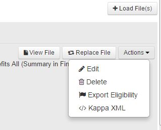

Manifestation panel 
====================

The panel dedicated to manifestation metadata is place on the top left part of the screen.

All the metadata applicable to all languages and all format is available at this level.

Through the Actions menu the following possibilities are available

.. warning:: not all types of objects are eligible to all the properties, and some depend on user rights, so you might no be able to see them all

Load files
--------------

When you click on this button the file window will open for you to choose an FTI file to load.

The name of the file is not important, because Kappa will rename it.

View file
---------

Once a file is loaded, you will be able to visualize it using this button.

Replace File
-------------

When an FTI is laready loaded, you can replace it easily using this button.

Edit
-----

The edit function, not only allows you to change some metadata, but also to view some metadata fields 
which are not shown directly on the first interface.

Delete
-------

The delete function allows you to delete the bibliographic record

.. note:: You will only be able to delete an object which has not already been exported. Otherwise the DOI will be active and you cannot delete it.
Please contact PACmetadata if you are trying to remove an object which has already been exported

Export Eligibility
-------------------

see :doc:`Eligibility`

KappaXML and Kappa XML with pyramid
------------------------------------

see :doc:`KappaXML`

 

