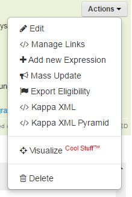
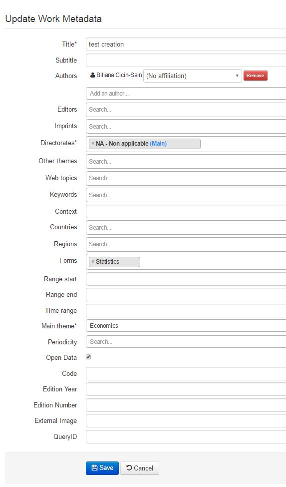
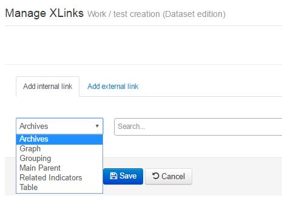
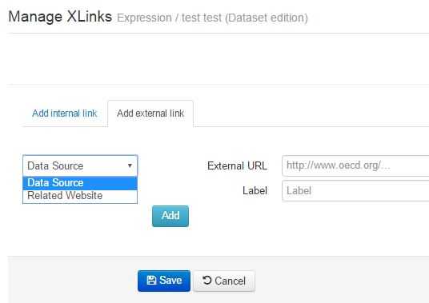
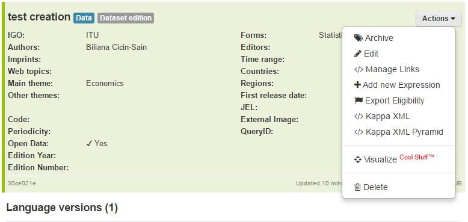

Work panel
==========

The panel dedicated to work metadata is placed on the top left part of the screen.

All the metadata applicable to all languages and all format is available at this level.

Through the Actions menu the following possibilities are available

.. warning:: not all types of objects are eligible to all the properties, and some depend on user rights, so you might no be able to see them all

Edit
-----

The edit function, not only allows you to change some metadata, but also to view some metadata fields 
which are not shown directly on the first interface.

Manage links
--------------

Through the manage links action you can edit or add all the links allowed at work level (see :doc:`Links` for details)

**Internal Links**

**External Links**

External links , need a label and a URL

.. note:: The links are checked against the taxonomy, you will not be able to enter invalid links, only the allowed for the level and the type of object

Add new expression
------------------

From the work it is possible to add a new expression. 

If you select this action, the creation from opens (for expression level only) and you can add the new language version

 
.. image:: images/CreationAddExpressionForm.JPG

Mass Update
------------
This function is currently only available for Summaries

please refer to :doc:`MultilingualSummaries`

Export Eligibility
---------------------

see :doc:`Eligibility`

KappaXML and Kappa XML with pyramid
------------------------------------

see :doc:`KappaXML`

Visualize
-------------
:doc:`Visualize`

 
Delete
-------

The delete function allows you to delete the bibliographic record

.. note:: You will only be able to delete an object which has not already been exported. Otherwise the DOI will be active and you cannot delete it.
Please contact PACmetadata if you are trying to remove an object which has already been exported

