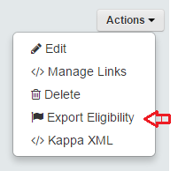
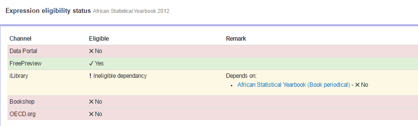

Export eligibility calculation feature
======================================

On every object  you see in Kappa, you will be able to know if it is eligible to be exported to iLibrary. 

Just  select actions and then  'Export Eligibility'

In the example,  this periodical book is not eligible because its parent serial is not eligible.

 