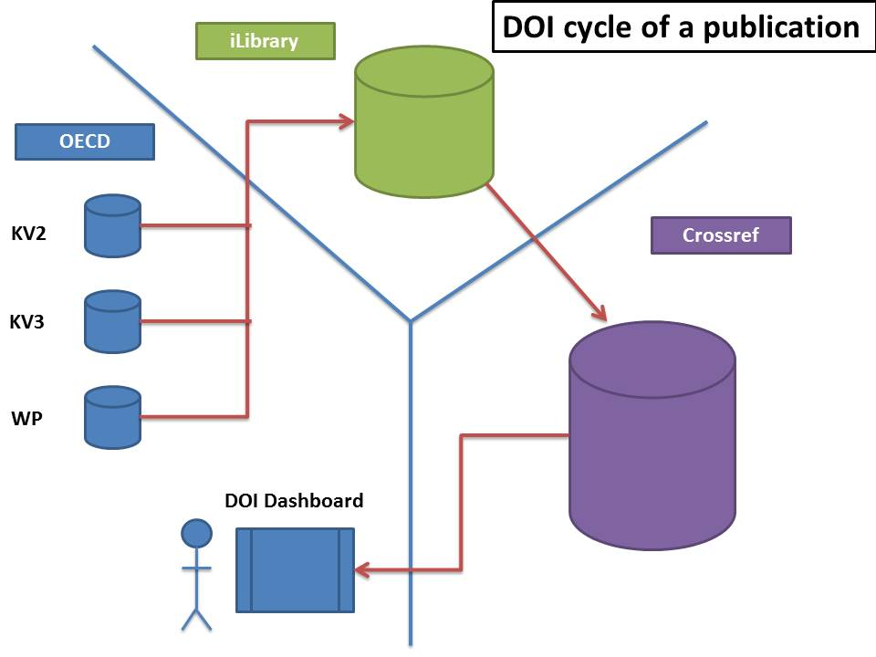

List of exports
===============

Platforms
----------
Kappa objects are exported to the following platforms when eligible (eligibility is different per export channel): 

* iLibrary: http://www.oecd-ilibrary.org/ 
* Free Preview: http://www.keepeek.com/Digital-Asset-Management/oecd/economics/etudes-economiques-de-l-ocde-hongrie-2002_eco_surveys-hun-2002-fr 
* OB: http://www.oecdbookshop.org/en/page/index/ 
* OLIS: http://olisweb.oecd.org/olis/portal/site/olisnet/ 
* Google: http://books.google.fr/books/about/OECD_Economics_Glossary_English_French.html?hl=fr&id=0jCYo4RbuuQC 
* RePEC: http://repec.org/ & http://econpapers.repec.org/paper/oeccfeaaa/2013_2f14-en.htm 
* Discovery services: http://discovery-service.oecdcode.org/ 
* DotStat - branded views: http://www.oecd-ilibrary.org/employment/data/oecd-productivity-statistics/gdp-per-capita-and-productivity-levels_data-00686-en 
* OECD.ORG: http://www.oecd.org/els/health-at-a-glance-europe-23056088.htm 
* Data Portal: http://data.oecd.org/drf/total-official-and-private-flows.htm 
* Turpin 

All the information on dependencies is available on  https://pacps01.oecd.org/redmine/projects/support/wiki/List_of_exports 

Embargo dates
-------------

Embargo dates are managed as follows

	* iLibrary/Freepreview/OB the object becomes available at date and time of embargo
	* Google/Discoveryservices à the object becomes available the day after 
	

DOIs
-----

DOI Dashboard
---------------
http://pac-apps.oecd.org/DoiDashboard/Submission 
	
