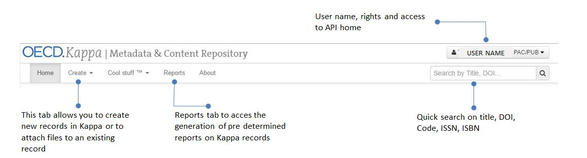
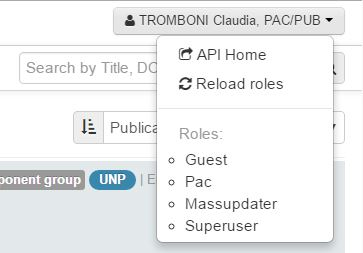
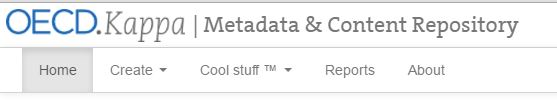
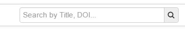
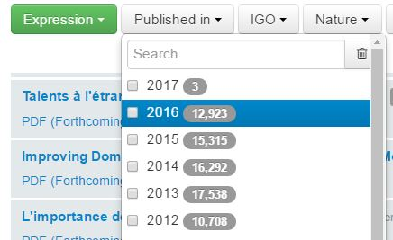
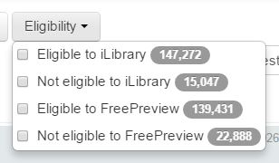
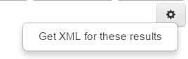

Home page
==========

http://kappa.oecd.org/v3

Kappa Home page contains the list of existing records which correspond to the criteria selected on the left column.

Usernamme, rights and access to API
------------------------------------

On the top right of the page, you will se your user name. Clicking on it the following menu will appear

* The first item will open the API Home in the next tab
* The following items indicate your roles (which define the rights you have for the Kappa application)

Tabs navigation
-----------------

Through the tabs menu you can access the following functionalities of the application:

* Creation of new records (either :doc:`loading XML metadata file <CreateUsingFiles>` or with :doc:`using the form <CreateUsingForm>` )
* Download metadata extracts via the :doc:`Reports Tab <ReportsTab>`
* Visualize the model and have fun
* Reach this user guide

Quicksearch box
----------------

In the quick search box you can enter the following search criteria:

* Title or subtitle
* DOI
* ISSN
* ISBN
* usercode
* WorkID, ExpressionID and ManifestationID

Facets
--------

.. image:: images/facets.JPG

The records are :

* Filtered at Expression level (different language versions of a publication regardless of their format). 
* Sorted by publication date (latest first)

The facets allow the user to filter the records with different criteria. The number of records corresponding to the criteria selected is shown.
For exemple it is possible to select a year and the number of expressions published each year appears next to the facet

**NOTE** : only applicable metadata appear. If you select ``IGO=UN`` you will not find ``Indicator`` as an available catalogue type because there are no indicators with the metadata ``IGO=UN``

You will find an interesting new facet which calculates eligibility criteria (as of day-1 export, not the live update)

you can also run a search using facets and download the XML of the result

More filtering options
------------------------
Follow this link to find more :doc:`filtering options <filteringOption>` available.