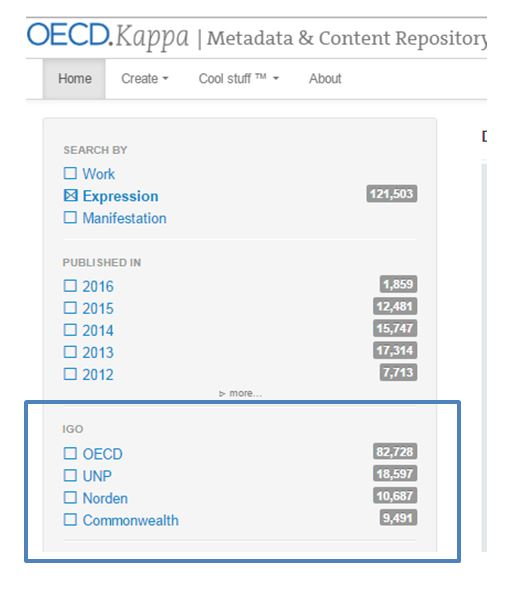
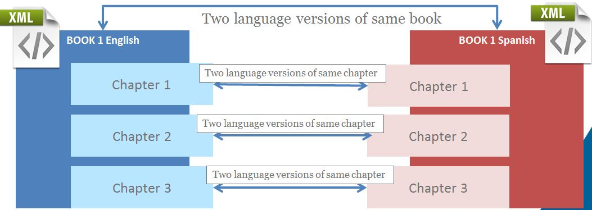
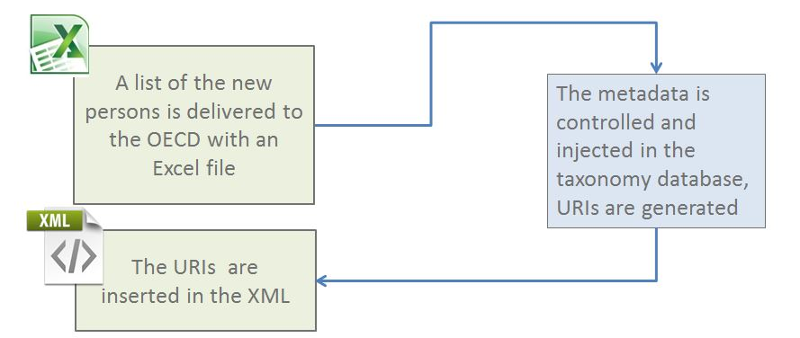

IGO management process
=======================

IGO is a metadata at work level
It is used to distinguish OECD content from that of other IGOs we on-board in Kappa and iLibrary

You can filter search results by IGO 

Creation of  metadata records
------------------------------

Metadata records for IGOs are created with the following process :

.. image:: images/1.JPG

**CREATION OF SERIAL RECORDS**

As first step of the process, the serial metadata are compiled into an excel file and delivered to the OECD.
The metadata excel file is made of three worksheets, each one corresponding to one type of serial which can be created in Kappa : Book series, Periodicals and Journal

Each line of the worksheet contains the necessary metadata to create one distinct serial in one language, or a multilingual serial and corresponds to one expression.

.. note:: The current process is used for serial creation and not for update. 
It is not possible to reload a new serial Excel files as soon as one of the serial in the excel file has already been exported. 
It not possible to change the typology of a serial (from periodical to book series for example)

**CREATION OF BOOK RECORDS WITH THEIR COMPONENTS (CHAPTERS OR ARTICLES)**

* The metadata of each distinct publication are compiled in XML files and loaded via the UI
* Each XML file contains all the necessary metadata to create the record of the publication and the records of all its chapters.
* The link between different language versions of a same publication is made in the XML  thanks to a XML property called ' is Translation of ' 
* The link between two chapters of two language versions is made only by their positioning in their respective parent publication XML. The two language versions publications' XML files must then contain the same number of chapters and the same structure.

Metadata Update
----------------

We can edit book/chapter metadata  by reloading of the publication XML file. 
This process will be used until it is possible to edit the metadata via the interface

Reloading of Publication XML file should be used in case of metadata change only.

Reloading of Publication XML does not support :

* change of the XML structure (i.e. order of chapters and sections)
* change of the typology of an object (e.g. from ' journal issue ' to ' standalone monograph ')

.. note:: It is not possible to change the publication typology (e.g. journal issue into annual book) or the XML structure (i.e. order of chapters and sections)

Batch loading of content files
--------------------------------

Overview of the process :

.. image:: images/2.JPG

Thanks to a file naming convention, Kappa identifies to which publication record the PDF should be attached to

Example of naming convention for the UN PDF files

+----------------+-------------------------------------------+----------------------------+
|                |                                           |                            |
|      Object    |                 File Naming               |            Example         |
|                |                                           |                            |
+================+===========================================+============================+
|                |                                           |                            |
|   Publications |   <ISBN>.pdf                              |   978921234567.pdf         |
|                |                                           |                            |
+----------------+-------------------------------------------+----------------------------+
|                |                                           |                            |
|   Chapters     |   <ISBN>c<chapter order>.pdf              |   978921234567c002.pdf     |
|                |                                           |                            |
+----------------+-------------------------------------------+----------------------------+
|                |                                           |                            |
|   Articles     |   <ISSN>v<volume>i<issue numbe>rc<article |   22190415v2014i11C002.pdf |
|                |   order>.pdf                              |                            |
|                |                                           |                            |
+----------------+-------------------------------------------+----------------------------+

* The PDF files are delivered with the cover of the book as the first page
* A thumbnail is needed for publishing purpose (for example for display on the iLibrary pages)
* This thumbnail is automatically extracted from the PDF when the PDF is loaded in Kappa,  and then stored in the thumbnail  multiformat store

Authors metadata acquisition
-----------------------------

Kappa taxonomy of persons and organisations is used to tag publications, chapters and articles metadata in order to associate them with authors, publishers or editors via an URI.
For the time being persons and organizations are created in kappa V2 and the synchronization between the two bases is guaranteed
If new persons/organizations need to be added to the author taxonomy, the workflow is the following:

