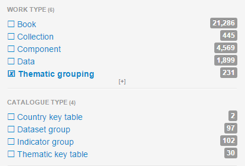
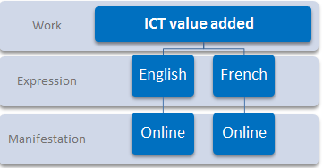
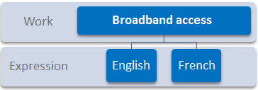
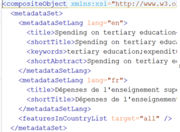
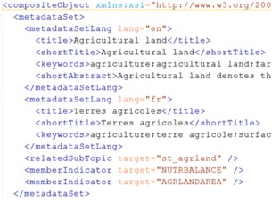
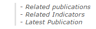
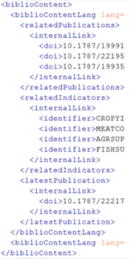

Indicators and indicator groups
================================

An indicator is a data object that contains descriptive text, links to related publications and associated data stored in oecd.stat.
An indicator group is a thematic grouping of indicators.

Indicators and Indicator Groups publishing process
---------------------------------------------------

.. image:: images/Indicators_process.PNG

**Prepare**

1) Indicator Data Curation and Global XLS files

* Multiple spreadsheets each containing data curation info for Stata (maintained by editors)

* One Global spreadsheet containing all codes (for OECD.Stat) and labels (including titles) in EN and FR (maintained by editor)

2) Generation of XML files from XLS

* Global and data curation XLS files are transformed to XML

* XML files from Global XLS file are batch Loaded into Editorial System by editor

**Create and manage**

* Indicator and group creation in the Editorial System
* Editors' data configuration XMLs are batch Loaded into Editorial System to enrich the Kappa content XML of existing indicators
* Kappa content XML exported from Editorial System to Kappa

**Deliver**

* Nightly processes: Kappa disseminates content to Data Portal and iLibrary via nightly exports

Process in detail 
------------------------

1. Editors maintain Excel files (in SVN) with necessary configuration for data load (by Stata from OECD.Stat source datasets to 
the Data Portal Staging cube) and (threshold) validation check (for data management tool).
2. Data in the Staging cube is validated and exported to the Live cube via the data management tool
3. Excel files must be converted into XML and loaded into the Editorial System

Global file: 

		1.Copy in this folder: P:\Tools\StatEditors\Excel2XML-EditorialSystem
		2.Drag and drop the file on launch.bat 
		3.XLS is converted into XML and resulting files stored under the XML/[fileName] subfolder
		4.Zip the files that need updating for loading in the Editorial System via the Batch function

Editors' config files

		1.Copy in this folder (together with the most up-to-date Global file): P:\Tools\StatEditors\Excel2XML-DataCuration
		2.Drag and drop the file on launch.bat 
		3.XLS is converted into XML and resulting files stored under the XML/[fileName] subfolder
		4.Zip the files that need updating for loading in the Editorial System via the Batch function
		

 		
4. Global file XMLs are loaded to the Editorial System

5. Indicators and groups are created in the Editorial System

6. Indicator files in the Editorial System are enriched with the data curation XMLs by importing them into that system via the 
Batch function

7. Files are exported from the Editorial System to Kappa when they are ready to publish

**STATA process Details**

* STATA reads all config information into memory
* STATA also reads data from source datasets into memory
* STATA writes instructions, data and metadata files to the Entry gate (to be loaded into Staging)
* STATA reads contents of Live cube and compares to Staging data and writes differences to data validation storage
* Entry gate writes data, labels and metadata into staging as per written instructions (CSV and XML files stored on network share). 
The EntryGate folder (\\dotstat\DWEntryGate\PAC - Data Portal) is a 'hot folder' where the service is reading from every number of 
seconds.
* Entry gate sends confirmation email or error report to a predefined address
* Log of STATA run recorded in data management tool

Search and Filter Indicators and Indicator Groups
-------------------------------------------------
h1. Search and Filter Indicators and Indicator Groups 

To easily search for indicators and groups in Kappa, it's useful to know their Work and Catalogue types

+--------------------+----------------------+
|   Catalogue Type   |   Work Type          |
+====================+======================+
|   Indicator group  |   Thematic Grouping  |
+--------------------+----------------------+
|   Indicator        |   Data               |
+--------------------+----------------------+

Create new Indicators and Indicator Groups
-------------------------------------------

The creation of Indicators and Indicator Groups **metadata record in Kappa is made automatically once the editors launch their 
export from the Editorial System**

Kappa extracts all the information needed from the XML files and automatically creates the bibliographic records (French and 
English).

When indicator and indicator group are created in Kappa, their **status is automatically set to ``Available`` 

.. note:: Exports to iLibrary and Data Portal can be blocked or the status of records changed to avoid an export, if necessary

**FOR INDICATORS**

Each XML file contains two languages from which, one work and two expressions (FR and EN) are created.
The only manifestation for the moment is the Data Portal page. This Online manifestation is created automatically.

**FOR INDICATOR GROUPS**

Each XML file contains two languages from which, one work and two expressions (FR and EN) are created.
The group does not have a page on its own, groups do not have a manifestation

**Information included in the XML **

There is one XML file per group and one per indicator, containing both French and English content.

**1. Metadata** : title, shortTitle, keywords, shortAbstract, subtopic, member indicators

For indicator

For group

**2. Bibliographies & Links**

**3. Text content** (description)

**4. Data Content** (curation and presentation rules)
 

Update and configure Indicators and Indicator Groups
-----------------------------------------------------------

**Rules applying to updating/configuring Indicators and Indicator Groups**

* The **subtopic** is assigned to Indicator groups and specified in the Indicator group XML
		If an indicator belongs to several groups in several subtopics, its subtopics will be inherited from the parent groups 

* Only if an indicator is **orphan**, the subtopic needs to be specified at the indicator level
		Orphan indicators are supported in Kappa but there's no Data Portal page design for them 

* If you load a valid indicator or group into Kappa and **do not want it be exported to the Data Portal, you should change its status to Not Yet Available** via the 
Kappa user interface.

.. tip:: An indicator Group is exported to iLibrary only if it has at least one member indicator, which is eligible for export. 

* When you **reload an indicator or group to Kappa**, its bibliographic record is replaced with the new XML but **the following 
metadata is preserved**:
* Date of first publication (iLibrary needs a publication date)
* DOI
* DOI title or original title 

.. note:: The title first declared when the DOI was generated is kept so that the DOI remains valid even if you make changes to the title. Note however that the **current title** (rather than the DOI) is exported to publishing channels 

* If **indicators are removed from a group or added to another, the indicator group XML files must be re-sent to Kappa** because:
	
	* Member indicators are declared in the group XML
	* The link between indicators and groups needs to be recalculated by Kappa

* Similarly, **if a group needs to be deprecated, member indicators should be reallocated to other groups**, where relevant, so no orphans are left, and relevant group files re-sent to Kappa

.. tip:: The Data Portal doesn't support orphan indicators at present. If any, their status should be set to Not yet Available until they can be assigned to a group

**DOIs**

* Every page on iLibrary needs a DOI (current publishing model)
* Indicators and Groups have (non-significant) DOIs
* If an indicator group or an indicator is **deleted**, the DOI link will not work and the page in iLibrary will show ``content deleted``
* If you **replace** an existing indicator group or an indicator with new content but their code is kept, the DOI link will still work

Dissemination Rules
--------------------

Some rules concerning the dissemination of Indicators and Indicator groups

* When indicator and indicator group are created in Kappa, their **status is automatically set to Available**
If necessary, 
exports to iLibrary/Data Portal can be blocked or the status of records changed to **Not yet available** via the Kappa user 
interface to avoid an export

* An indicator Group is exported to iLibrary only if it has at least one member indicator, which is eligible for export.

* The Data Portal doesn't support orphan indicators at present. If any, their status should be set to Not yet Available until 
they can be assigned to a group.

* Note the **current title** (rather than the DOI title) is exported to publishing channels.
