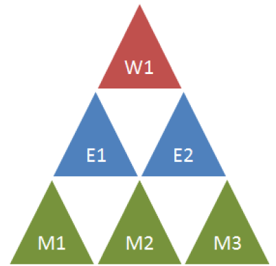
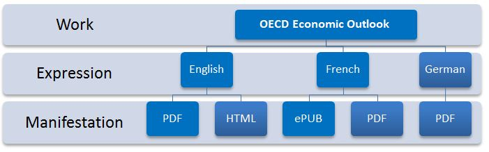

What you need to know about Kappa's data model
==============================================

Work Expression and Manifestation
----------------------------------

The Kappa catalogue is structured following a three-tier bibliographic standard known as the `Functional Requirement for Bibliographic Records (FRBR) <http://archive.ifla.org/VII/s13/frbr/frbr_current_toc.htm>`_

This model classifies a published object into Work, Expression and Manifestation.

We often refer to the three levels as the *pyramid*:

**The work** is a distinct intellectual or artistic creation.  In Kappa, the work is the shell which groups all language versions of a publication. We usually refer to it using metadata in English (when it exists), but it is just our best practice to simplify search because the work is independent of the language. Metadata at work level apply to all languages and include mainly subject/country/semantic tagging.

**The expression** is the specific intellectual or artistic form that a work takes each time it is realized. In Kappa, the expression corresponds to the language version. We can have monolingual or multilingual expressions. All the metadata at this level are language-dependent and include title, abstract, keywords, etc.

**The manifestation**  is the physical embodiment of an expression of a work, it represents all the physical objects that bear the same characteristics,
in respect to both intellectual content and physical form.
In Kappa, manifestation correspond to the different formas: HTML, PDF, ePub etc.

Below is a very simple illustration of the FRBR levels applied to one OECD publication; fortunately for you, this is the minimum you need to know to navigate through Kappa user interface:

