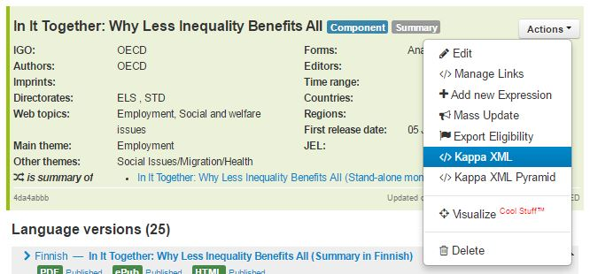
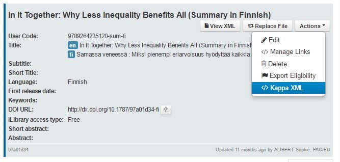
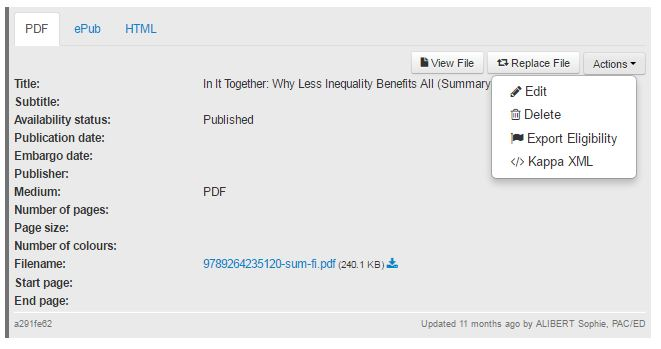
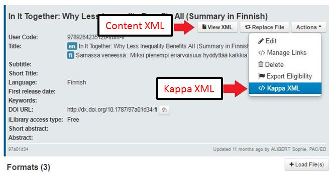

Kappa XML vs Content XML
========================

As you know, Kappa is an XML database. The pyramid model objects are stored in XML.

Kappa XML
------------

The internal format of the database is what we call the kappa XML.

You can vizualise the Kappa XML in two different ways, either showing the whole pyramid or only a slice at a certain level
(Work, Expression or Manifestation)

To retrieve the Kappa XML with the whole pyramid, just click on the ``Actions`` menu at work level :

At each level you will be able to retrieve the Kappa XML of that level via the ``Actions`` menu at the corresponding level :

Expression

and Manifestation

Content XML
-------------

A second XML stored in the database and it is called the content XML.

The content XML can follow the rules of different schemas following the creation rules.
see also : :doc:`How to create a record from XML files </CreateUsingFiles>`

The content XML is visible at expression level when it is available.

Just click on ``view XML``

