Links 
======

Links provide access from one resource to another, and define the relationship between the two. 

They can be internal (links between OECD publications having a record in Kappa) or external 
(links from OECD publications to websites or resources located outside of Kappa).

Links can be created in different ways:

* Automatically when an object is created (pyramid links for example)
* Via the loading of a content XML if de schema allows the definition of the link (member indicators in the XML of an indicator group for example)
* Manually via the interface (default child of a database for example)
* Via a functionality of the Kappa application (when archiving a dataset for example)

Most of the links managed in Kappa are bidirectional: if a link is created from object A to object B, 
the reciprocal link from B to A will be created too (always automatically). 

This automation also applies to the deletion of bidirectional links (if a link from A to B is deleted, 
the reciprocal link from B to A is deleted).

.. note:: In kappa V3 all the direct links go from the parent to the child, the reverse links are calculated and cannot be created manually by the user.

We have identified six different families of links between objects:

* Pyramid links
* Include links 
* Coproduct links
* Highlight links
* Lifecycle links
* Related links

1. PYRAMID LINKS
=================

.. image:: images/PyramidLinks.PNG

Other languages and Other versions
-----------------------------------

These links were explicited via cross references in Kappa V2 because the model of the old base needed them, 
but Kappa V3 uses the FRBR model and all these pyramid links become 
implicit for the user. We can can visualise a Kappa V3 object as a pyramid.

* The link between different expressions of the same work gives the ``other languages``. In iLibrary they 
are displayed after the label ``Also available in``

* The link Link between different manifestations of the same expression gives us the ``other versions``
Links to all electronic versions of a publication 
are included on the iLibrary homepage of that publication.

Freepreview and Active chart
-----------------------------

Other links which existed in Kappa V2 are now considered as manifestation formats and they also become pyramid links 

* Freepreview Manifestation: 
* Active chart (a JSON manifestation of this table)

Online Bookshop URL
---------------------

``Online Bookshop URL`` becomes a metadata at manifestation level,used to link to the page of an item on the 
Online Bookshop. It is visible on iLibrary
via the publication / serial homepages: buy this book OR ``yearly subscription``

2. INCLUDE LINKS
==================

Include links establish the relationship between an object and its components, from serial to publication level, 
but also from book to chapter and chapter to graph.

They are all at Work level.

All the targets of these links are ``included in`` the source so their reverse link is ``is included in`` 
The exception is a link specific for thematic groupings which is ``has member``. Its corresponding reverse link 
is ``is member of``.

-----------------------------------------------------------------------------------------------------------------------------------

hasIssue
---------

Ordered link with the following source

+------------------------+------------+
| Source                 | Source Type|
+========================+============+
| Journal                | ``1201``   |
+------------------------+------------+
| Collection             | ``coll``   |
+------------------------+------------+
| Statistical periodical | ``1202``   |
+------------------------+------------+
| Outlook periodical     | ``1203``   |
+------------------------+------------+
| Book Periodical        | ``1204``   |
+------------------------+------------+
| Book Periodical        | ``1205``   |
+------------------------+------------+

And the following targets

+------------------------+-------------+
| Target                 | Target Type |
+========================+=============+
| Journal                |  ``1201``   |
+------------------------+-------------+

In the work panel, you will see the label ``Issue/Book`` and the number of issues included in the serial

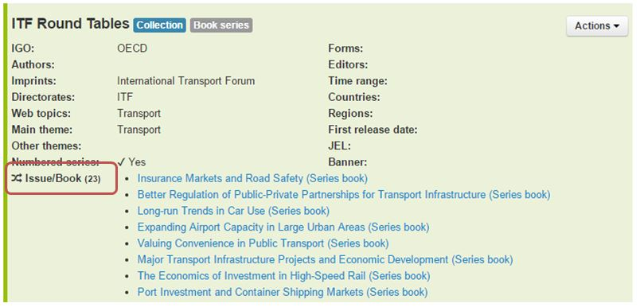

The reverse link is shown in the book/Issue page :

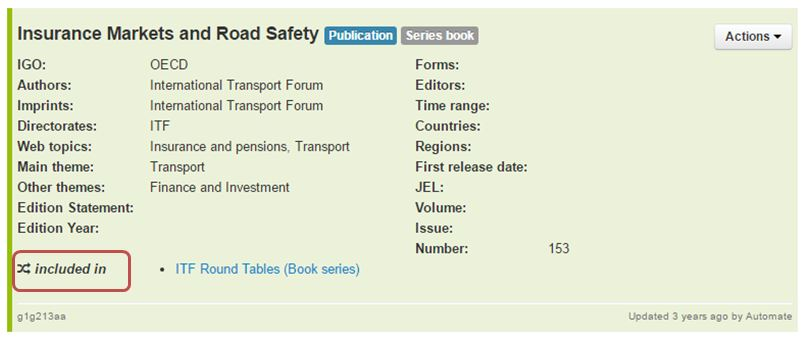

.. note::  Migration from Kappa V2 or Working Papers database using ``ProductSubscription (Xref = 250)`` and using ``ProductSubscription (Xref = 350)``

-----------------------------------------------------------------------------------------------------------------------------------

hasChapter
-----------

Ordered link with the following source

+------------------------+------------+
| Source                 | Source Type|
+========================+============+
| book                   | ``publ``   |
+------------------------+------------+

And the following target

+------------------------+-------------+
| Target                 | Target Type |
+========================+=============+
| Chapter                | ``1401``    |
+------------------------+-------------+

In the work panel, you will see the label ``Chapters`` 

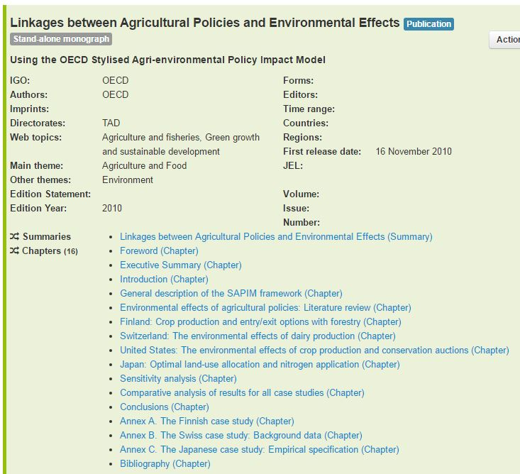

The reverse link is shown in the chapter page :

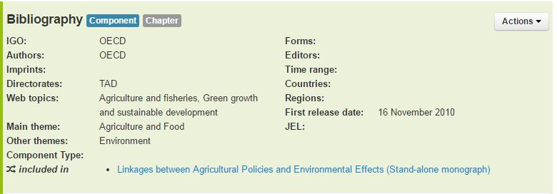

.. note::  Migration from Kappa V2 or Working Papers database using ``Xref Chapter (11)``

-----------------------------------------------------------------------------------------------------------------------------------

hasArticle
-----------

An article can belong to a journal Issue, or be published online first without an issue. in this case it will be attached directly to the Journal

+-----------------------+------------+
| Source                | Source Type|
+=======================+============+
| Journal               | ``1201``   |
+-----------------------+------------+
| Journal Issue         | ``1304``   |
+-----------------------+------------+

And the following target

+-----------------------+-------------+
| Target                | Target Type |
+=======================+=============+
| Article               | ``1505``    |
+-----------------------+-------------+

In the work panel, you will see the label ``Articles`` 

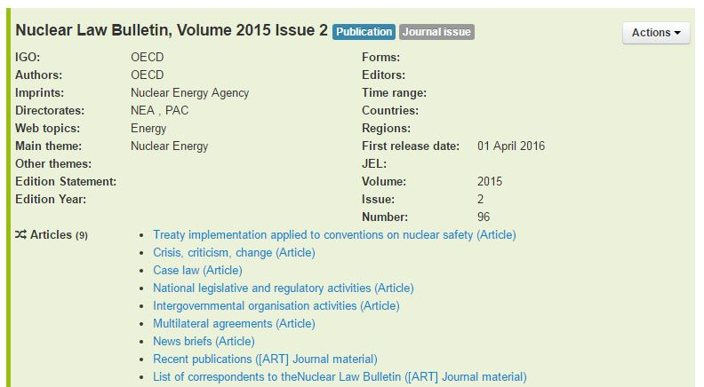

The reverse link is shown in the Article page :

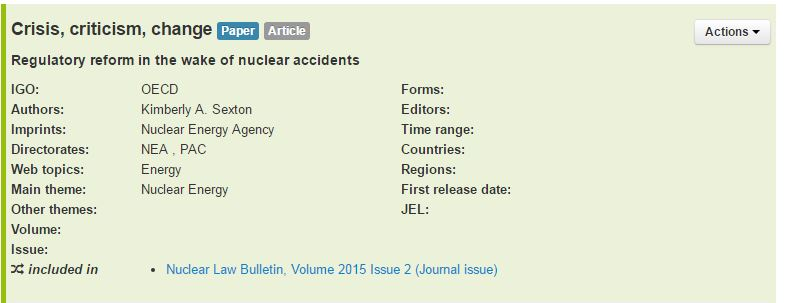

.. note::  Migration from Kappa V2 or Working Papers database using ``ProductSubscription (Xref = 150)`` 

-----------------------------------------------------------------------------------------------------------------------------------

hasPaper
---------

Ordered link with the following source

+------------------------+------------+
| Source                 | Source Type|
+========================+============+
| Working Paper Series   | ``1104``   |
+------------------------+------------+

And the following target

+------------------------+-------------+
| Target                 | Target Type |
+========================+=============+
|  Working paper         | ``1502``    |
+------------------------+-------------+

In the work panel, you will see the label ``Paper`` 

The reverse link is shown in the Paper page :

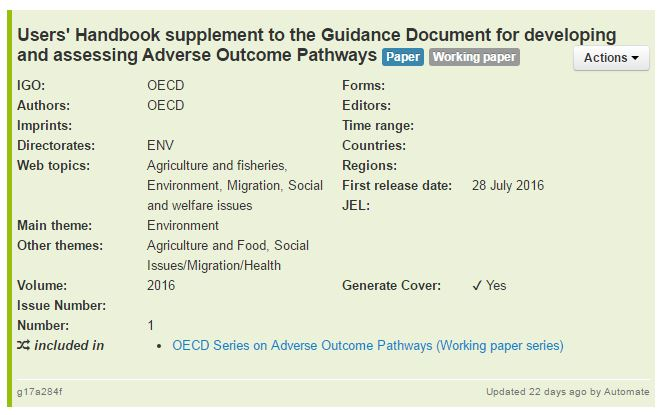

.. note::  Migration from Kappa V2 or Working Papers database using link from document to series via seriesId

-----------------------------------------------------------------------------------------------------------------------------------

hasData
--------

Ordered link with the following source

+------------------------+------------+
| Source                 | Source Type|
+========================+============+
|Database                | ``1105``   |
+------------------------+------------+
|Dataset group           | ``1004``   |
+------------------------+------------+

And the following target

+------------------------+-------------------+
| Target                 | Target Type       |
+========================+===================+
| Dataset                | ``1601`` ``1604`` |
+------------------------+-------------------+

In the work panel, you will see the label ``Data`` 

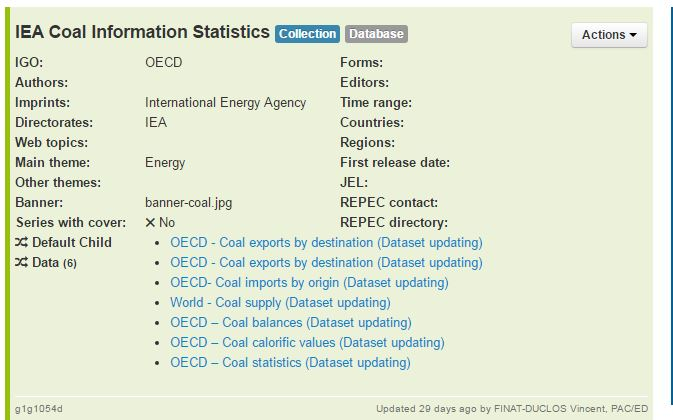

The reverse link is shown in the Dataset page :

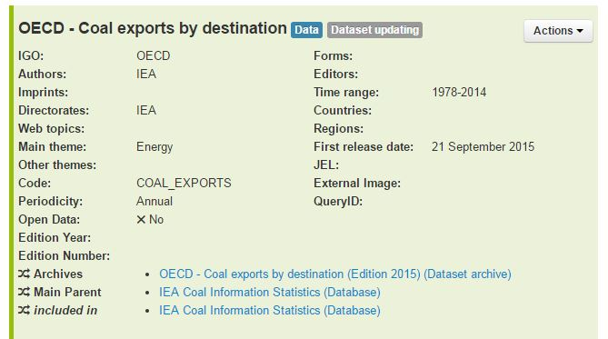

-----------------------------------------------------------------------------------------------------------------------------------

hasGrouping
------------

Ordered link with the following source

+------------------------+------------+
| Source                 | Source Type|
+========================+============+
| any object             | all        |
+------------------------+------------+

And the following target

+------------------------+-------------+
| Target                 | Target Type |
+========================+=============+
| Thematic Grouping      | ``thgr``    |
+------------------------+-------------+

In the work panel, you will see the label ``Grouping`` 

The reverse link is shown in the Thematic Grouping page :

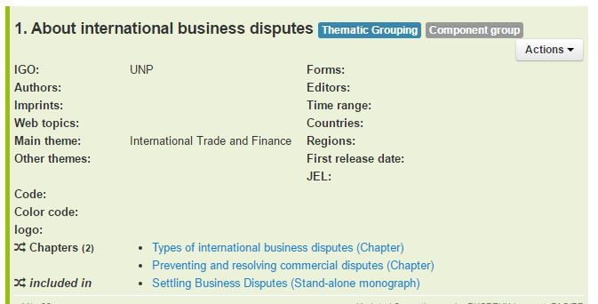

-----------------------------------------------------------------------------------------------------------------------------------

hasMember
---------

This link is specific to indicator Groups, it links to the indicators composing it.

Ordered link with the following source

+------------------------+------------+
| Source                 | Source Type|
+========================+============+
| Indicator Group        | ``1001``   |
+------------------------+------------+

And the following target

+------------------------+-------------+
| Target                 | Target Type |
+========================+=============+
| Indicator              |  ``1603``   |
+------------------------+-------------+

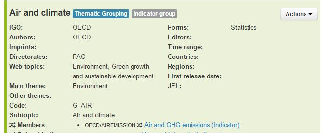

The reverse link is shown in the Indicator page with the label ``Member of``

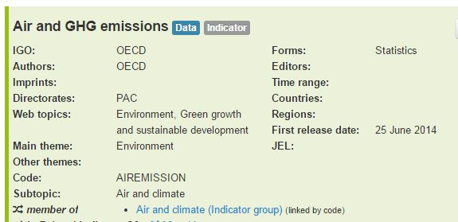

-----------------------------------------------------------------------------------------------------------------------------------

hasTable
--------

Tables have not been migrated, this link is not in place yet. It will connect a publication to the tables contained in it.

-----------------------------------------------------------------------------------------------------------------------------------

hasGraph
---------

Graphs have not been migrated, this link is not in place yet. It will connect a publication to the graphs contained in it.

3. COPRODUCT LINKS
===================

The coproduct links connect Kappa Objects to products which use the same or similar content. They are not included,
they have their own existence.

For the moment we have identified three different coproducts:

* **Multilingual summaries**: translations in several languages of the executive summary of a publication (sometimes this contet 
may have been revised and will not correspond exactly to the executive summary)

* **Dataset Archives** : frozen csv versions of a dataset or a previous online version of a current edition dataset

* **Briefs**: like Policy Briefs or statistical briefs. They take the content from one or several publication and condensate 
it with a short analysis

HasSummary
-----------

Link with the following source

+------------------------+------------+
| Source                 | Source Type|
+========================+============+
| Book                   | ``publ``   |
+------------------------+------------+
| Component              | ``comp``   |
+------------------------+------------+
| Paper                  | ``pape``   |
+------------------------+------------+

And the following target

+------------------------+-------------+
| Target                 | Target Type |
+========================+=============+
| Summary                | ``1402``    |
+------------------------+-------------+

In the work panel, the label is ``Summaries``

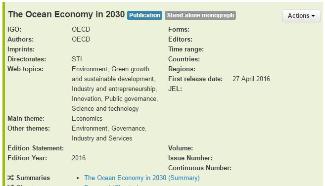

The reverse link is shown in the Summary page with the labe ``Is Summary of``

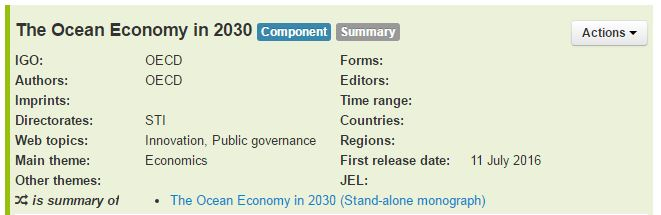

HasArchive
-----------

Link with the following source

+------------------------+--------------------+
| Source                 | Source Type        |
+========================+====================+
| Dataset                | ``1601``  ``1604`` |
+---------------------------------------------+

And the following target

+------------------------+-------------+
| Target                 | Target Type |
+========================+=============+
| Dataset archive        | ``1605``    |
+------------------------+-------------+

In the work panel with the label ``Archives``

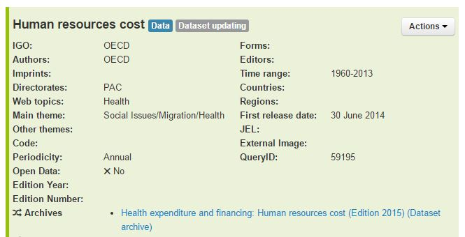

The reverse link is shown in the Dataset Archive page with the label ``Is Archive of`` :

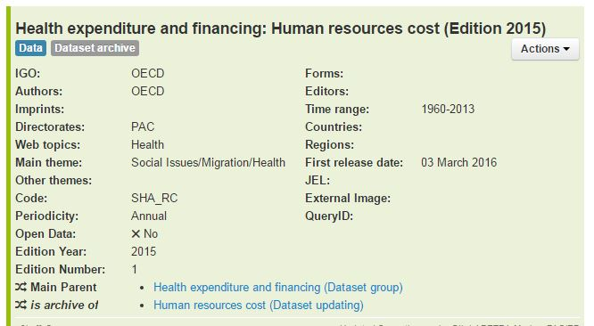

4. HIGHLIGHT LINKS
==================

Default child
--------------

Some databases and dataset groups have multiple children (datasets or dataset groups). 

This link is used to indicate which of these children is the default one and should be given priority for iLibrary display.

* A database or database group must have a default child, this is necessary for a correct display in both iLibrary and Branded Views.
* A default child link can only be created towards a dataset or dataset group which is already included in the database/dataset 
group.

Link with the following source

+------------------------+------------+
| Source                 | Source Type|
+========================+============+
|Database                | ``1105``   |
+------------------------+------------+
|Dataset group           | ``1004``   |
+------------------------+------------+

And the following target

+------------------------+---------------------+
| Target                 | Target Type         |
+========================+=====================+
| Dataset                | ``1601``, ``1604``  |
+------------------------+---------------------+
| Dataset group          | ``1004``            |
+------------------------+---------------------+

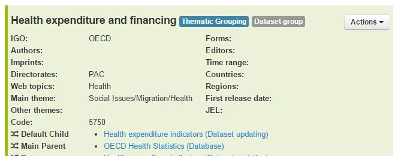

This link is not bidirectional and has no reverse link.

.. Warning::  ``Main parent`` is **NOT** the reverse link of ``default child``

Main Parent
------------

Some datasets can have multiple parent databases or dataset groups, and similarly, some dataset groups may have multiple parent 
databases.  

This link is used to indicate which of these parents is the main one, and should be given priority for iLibrary display. 

* A dataset must have a main parent, this is necessary for a correct display in both iLibrary and Branded Views.
* A link from a dataset to a database can only be made if the dataset is included in the database.
* A link from a dataset to a dataset group can only be made if the dataset is a member of the dataset group

Link with the following source

+------------------------+--------------------+
| Source                 | Source Type        |
+========================+====================+
|Dataset                 | ``1601``, ``1604`` |
+------------------------+--------------------+
|Dataset archive         | ``1605``           |
+------------------------+--------------------+
|Dataset group           | ``1004``           |
+------------------------+--------------------+

And the following target

+------------------------+-------------+
| Target                 | Target Type |
+========================+=============+
|Database                | ``1105``    |
+------------------------+-------------+
|Dataset group           | ``1004``    |
+------------------------+-------------+

This link is not bidirectional and has no reverse link.

.. Warning::  ``Main parent`` is **NOT** the reverse link of ``default child``

5. LIFECYCLE LINKS
===================

They are at expression Level because they might be different for two language versions of the same work.

Continues
----------

Used when a serial has been discontinued because of a change in title, and is continued by another serial under a 
new title.

* A serial can be continued by one or more serials. If a serial is continued by more than one title, this case is referred to as a split.

* A serial can continue one or more serials. If a serial continues more than one title this case is referred to as a merge.

* A link to the old version is shown on iLibrary 

Link with the following source

+------------------------+------------------+
| Source                 | Source Type      |
+========================+==================+
| Collection             | ``coll``         |
+------------------------+------------------+
| Periodical             | ``peri``         |
+------------------------+------------------+
| Thematic grouping      | ``thgr``         |
+------------------------+------------------+
| Dataset                | ``1601``,``1604``|
+------------------------+------------------+
| Dataset Archive        | ``1605``         |
+------------------------+------------------+

And the following target

+------------------------+------------------+
| Target                 |Target Type       |
+========================+==================+
| Collection             | ``coll``         |
+------------------------+------------------+
| Periodical             | ``peri``         |
+------------------------+------------------+
| Thematic grouping      | ``thgr``         |
+------------------------+------------------+
| Dataset                | ``1601``,``1604``|
+------------------------+------------------+
| Dataset Archive        | ``1605``         |
+------------------------+------------------+

In the Expression panel with the label ``Continues``

The reverse link is shown with the label ``Continued by`` :

.. note::  Migration from Kappa V2 or Working Papers database using ``Xref Continues (16)``

Replaces
---------

Identifies the new edition of a publication which has been replaced by a more recent edition in the same language and 
format.  It is used with the reciprocal link Replaces.
Used to identify the previous edition of a publication which is replacing all earlier editions in the same language. It is used 
with the reciprocal link Replaced by
For datasets, no link to the replaced dataset is shown. 
Items having a *replaced by* link to another publication have no full-text item on their iLibrary homepage. 
This full-text item may exists in KAPPA but it won't be displayed on iLibrary: A Replaced by link brings the user to the current edition's 
homepage, for which a full text item is available.

Link with the following sources

+------------------------+-------------------+
| Source                 | Source Type       |
+========================+===================+
| Collection             | ``coll``          |
+------------------------+-------------------+
| Periodical             | ``peri``          |
+------------------------+-------------------+
| Book                   | ``publ``          |
+------------------------+-------------------+
| Thematic grouping      | ``thgr``          |
+------------------------+-------------------+
| Dataset                | ``1601`` ``1604`` |
+------------------------+-------------------+
| Dataset Archive        | ``1605``          |
+------------------------+-------------------+

And the following targets

+------------------------+-------------------+
| Target                 |Target Type        |
+========================+===================+
| Collection             | ``coll``          |
+------------------------+-------------------+
| Periodical             | ``peri``          |
+------------------------+-------------------+
| Book                   | ``publ``          |
+------------------------+-------------------+
| Thematic grouping      | ``thgr``          |
+------------------------+-------------------+
| Dataset                | ``1601`` ``1604`` |
+------------------------+-------------------+
| Dataset Archive        | ``1605``          |
+------------------------+-------------------+

In the expression panel you will see it with the label ``Replaces``

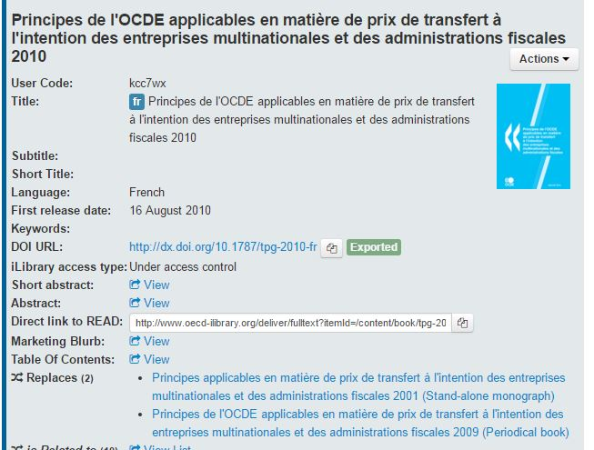

And the reverse link ``Is replaced by``

.. image:: images/ReplacesReverse.JPG

.. note::  Migration from Kappa V2 or Working Papers database using ``Xref Replaces (51)``

6. RELATED LINKS 
=================

Related Indicator
------------------

This link is different from the other related links because it is not placed at expression Level, but at work level.

It is done this way because of historical reasons (indicators are one of the first objects managed in Kappa)
dependencies with other projects make it necessary to keep the current situation.

It will not be possible to have different related indicators in French and English, they have to be the same.

Link with the following source

+------------------------+------------+
| Source                 | Source Type|
+========================+============+
| Any object             | All        |
+------------------------+------------+

And the following target

+------------------------+-------------+
| Target                 | Target Type |
+========================+=============+
| Indicator              | ``1603``    |
+------------------------+-------------+

In the work panel you will see the label ``Related Indicators`` as well as the code of the indicators.

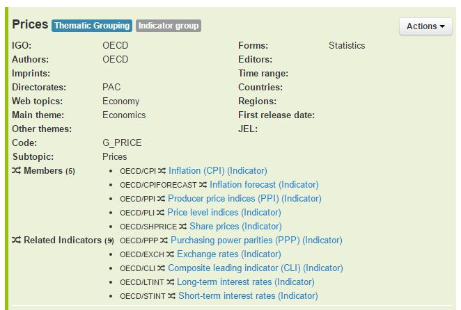

The reverse link is shown in the Indicator page 

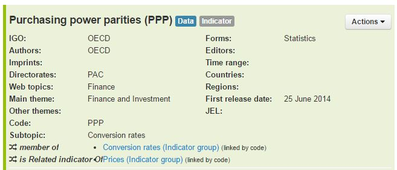

Featured Publication
--------------------

Used to link a database to its corresponding statistical periodical or statistical publication.

In iLibrary, the tables of the statistical publication are shown in the right hand side of the database page.

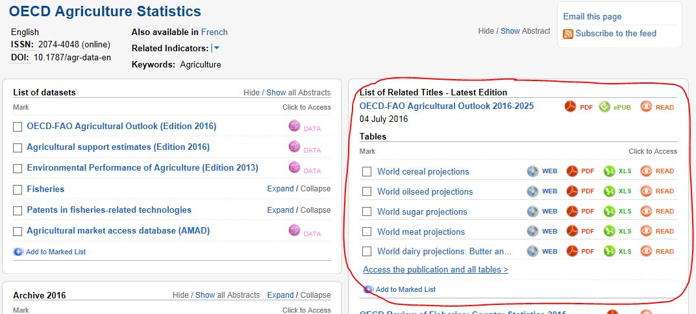

It is the reciprocal link of ``related database``. 

It is generated automatically from item B to item A if a ``related database`` link has been created from item A to item B.

Link with the following source

+------------------------+------------+
| Source                 | Source Type|
+========================+============+
| Database               | ``1105``   |
+------------------------+------------+

And the following target

+------------------------+-------------+
| Target                 | Target Type |
+========================+=============+
| Collection             | ``coll``    |
+------------------------+-------------+
| Periodical             | ``peri``    |
+------------------------+-------------+
| Thematic grouping      | ``thgr``    |
+------------------------+-------------+
| Book                   | ``publ``    |
+------------------------+-------------+

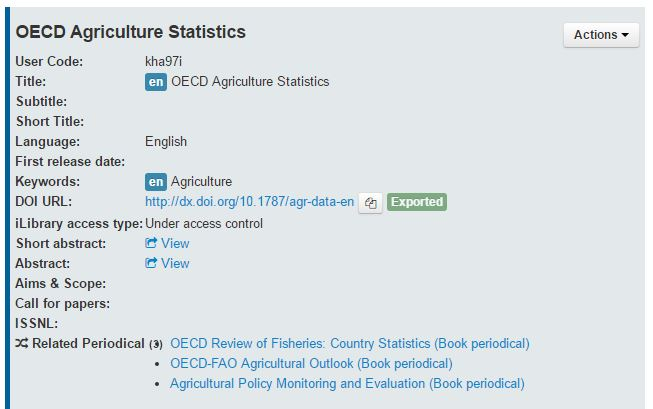

The reverse link is shown in the  page :

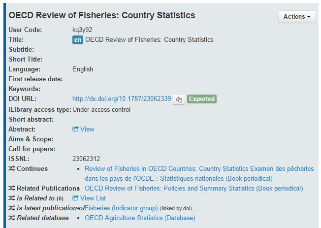

.. note::  Migration from Kappa V2 or Working Papers database using ``Xref Related Periodical (22)``

Related Publication
--------------------

The ``related publication`` link should be assid based on the content of the publication. It should be used to link to other 
material covering the same topic and allow the iLibrary user to discover by navigating titles in his area of interest which 
he might not have found through his initial search query. 
This link should in priority be used to link items of the same language and in the same medium version. 
However, if this is not possible in a given case, the link can be used in more flexible ways. 

Note that the ``related publication`` link should not be applied in the following cases:
* between two publications which have already been linked by an automatic link. 
* to link two items which are already linked by one of the following intellectual links:
	* has source or method
	* is source or method of
	* related database
	* related periodical

For statistical serials (statistical collections and key table collections), the ``related publication`` links should not be used to 
link to other statistical serials sharing the same theme. 

For instance, links from Statistical collection to Key Tables in the same theme are dynamically generated on iLibrary and appear 
under the label *Key Tables on*.  Similarly, Key Table Collections linking to a Statistical Collection sharing the same theme are 
dynamically generated and displayed under the lable *Interactive databases*.

The ``related publication`` link should only be used to link to an internal resource (ie an item within KAPPA). The equivalent external 
link is *Related Website*.

Link with the following source

+------------------------+------------+
| Source                 | Source Type|
+========================+============+
| Any Object             | all        |
+------------------------+------------+

And the following target

+------------------------+-------------+
| Target                 | Target Type |
+========================+=============+
| Any Object             | all         |
+------------------------+-------------+

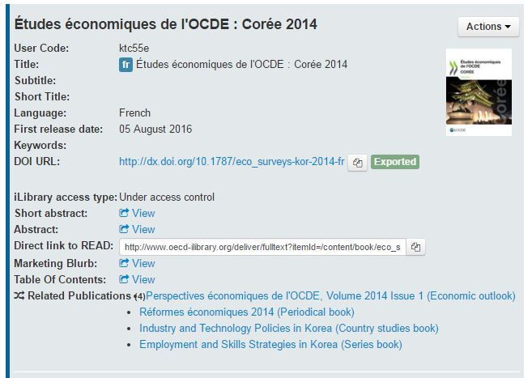

The reverse link can tell you in which other publications this title is cited related

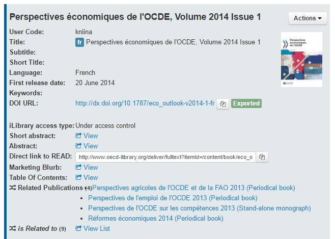

Some publications are often cited as related publication, so you will have to click on view list to show them all on a separate window

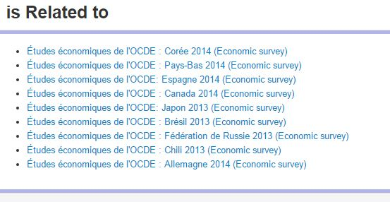

.. note::  Migration from Kappa V2 or Working Papers database using ``Further reading Xref ``

Related Websites
-----------------
	
A type of ``related website`` link from items in the OECD publications catalogue to external sources (i.e. 
outside of KAPPA) of related content.
It should be used to link to external websites of interest.		
For display purposes on the iLibrary, both internal (``related publication``) and external (``related website``) related links are presented 
by clicking on the drop down arrow for Related titles. ``related publication`` links are displayed first in alphabetical order and are 
followed by ``related website`` links also displayed in alphabetical order

Link with the following source

+------------------------+------------+
| Source                 | Source Type|
+========================+============+
| Any Object             | all        |
+------------------------+------------+

And the following target

+------------------------+-------------+
| Target                 | Target Type |
+========================+=============+
| External Website       | URL + Label |
+------------------------+-------------+

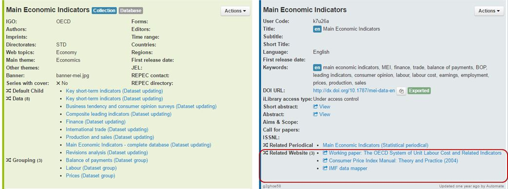

.. note::  Migration from Kappa V2 or Working Papers database using `` RelationInternal Related Website (20)``

DataSource
------------

Used to link a key table or a table/graph within a book to the statistical collection or dataset which is the source of the data it contains.
Used to link an indicator to its data source (dataset updating or edition)	Data Source (internal)	The display of this link is not supported by iLibrary yet, but will be with a future version.

In Kappa the Data source can be either internal or external. In the case of an external link, you will have to enter URL and Label.

Link with the following source

+------------------------+------------+
| Source                 | Source Type|
+========================+============+
| Any Object             | all        |
+------------------------+------------+

And the following target

+------------------------+-------------------+
| Target                 | Target Type       |
+========================+===================+
| Dataset                | ``1601`` ``1604`` |
+------------------------+-------------------+
| Dataset group          | ``1004``          |
+------------------------+-------------------+
| Database               | ``1105``          |
+------------------------+-------------------+

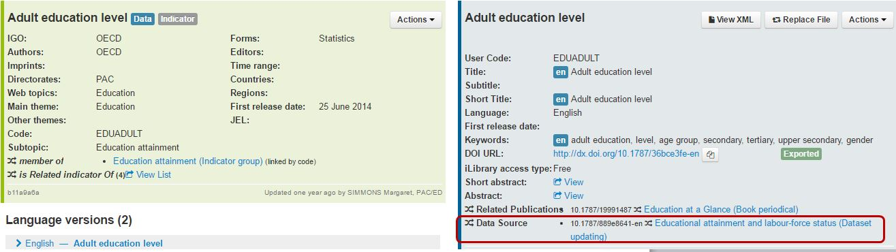

The reverse link is shown in the Dataset or other Data Source page
(again in the example you will have to click on ``View List`` :

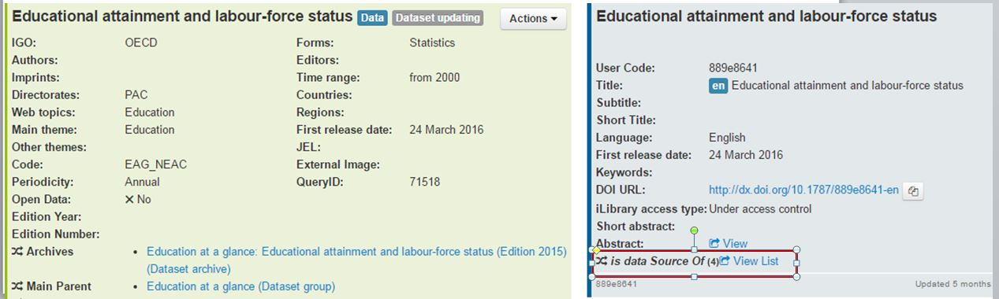

.. note::  Migration from Kappa V2 or Working Papers database using ``Xref Data source (19) and ``RelationInternal Data Source (10)``

Latest Publication
-------------------

Used in Indicator groups to link to the latest issue of the most related periodical

Link with the following source

+------------------------+------------+
| Source                 | Source Type|
+========================+============+
| Indicator Group        |  ``1001``  |
+------------------------+------------+

And the following target

+------------------------+-------------+
| Target                 | Target Type |
+========================+=============+
|  Collection            | ``coll``    |
+------------------------+-------------+
|  Periodical            | ``peri``    |
+------------------------+-------------+
|  Thematic grouping     | ``thgr``    |
+------------------------+-------------+

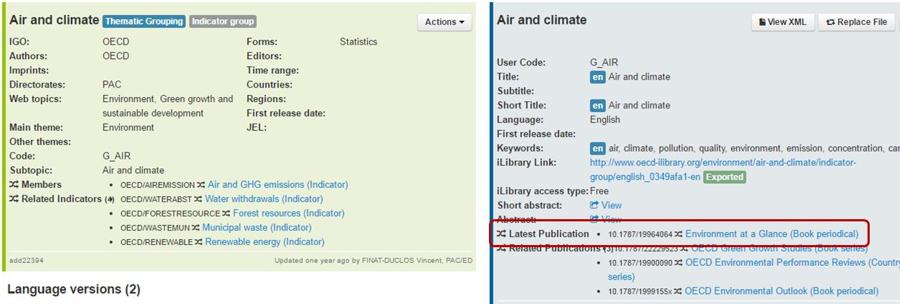

The reverse link is shown in the  page of the periodical.

In this example the periodical is the latest publication of several
indicator groups

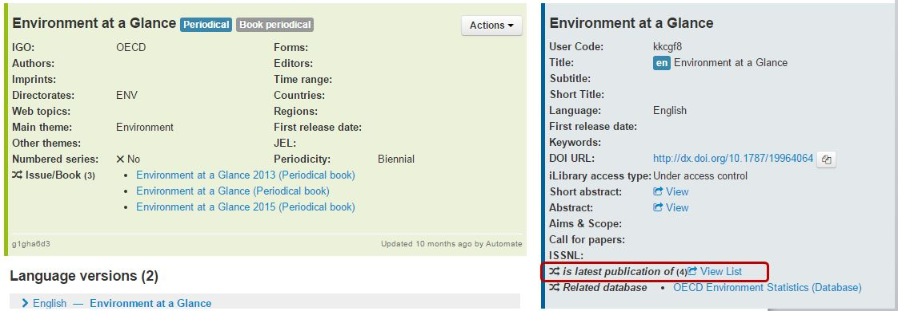

You need to click on ``View List`` and a modal window will open
with the list of indicator groups

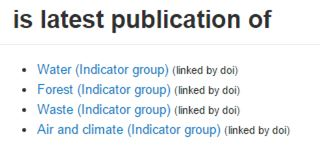
