Multilingual summaries
=======================

OECD Publishing provides freely-available translations of the Executive Summaries of many key publications.  Most of the time the textual content of a MLS text is the same as the executive summary within the publication, but in some it may be different if the Editorial team judges useful to change the publication initial text. These summaries provide a synopsis of the contents and main findings from the full publication. 
They can be translated into over 20 languages. 
Available on the OECD iLibrary and main website at the publication date into PDF format, HTML and ePUB 

The following functions are available for multilingual summaries

List Summaries
----------------

 .. image:: images/ML-list-all.JPG

 
 Search and filter summaries
-----------------------------

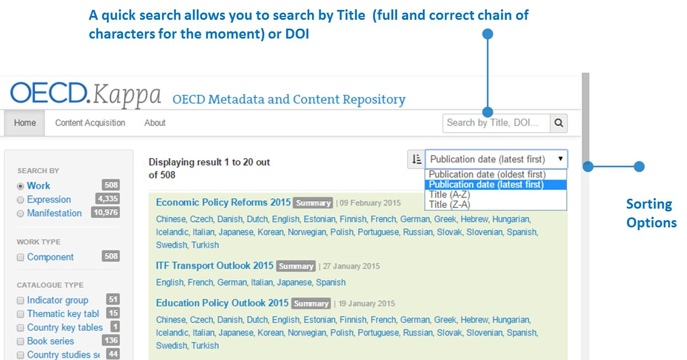

Create new summaries
-----------------------

* You can generate multiple summaries in one batch

* The xml of a multilingual summary contains the metadata of the parent book (used to generate the work title) so you can start creating from any language (or all the languages at the same time). 

* Work level metadata as theme, webtopic, directorate are inherited from the parent book

* When a Multilingual summary is reloaded, the former one is overwritten BUT DOI and DOI title are preserved.

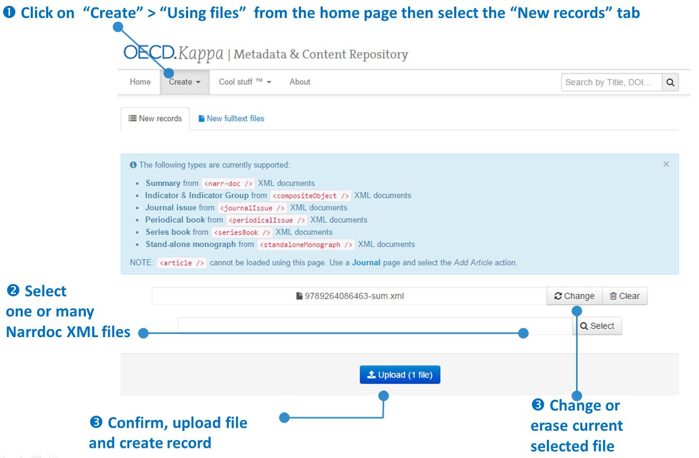

Select Narrdoc XML file(s)

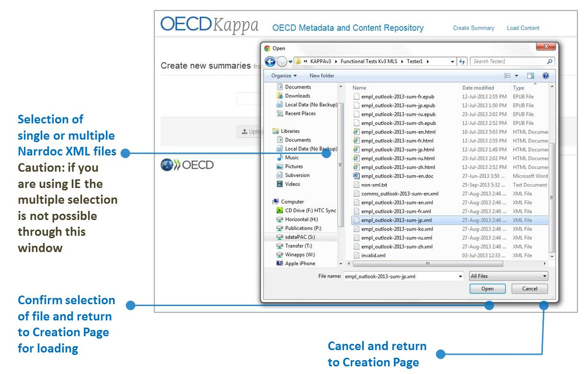

Upload Narrdoc XML file(s)

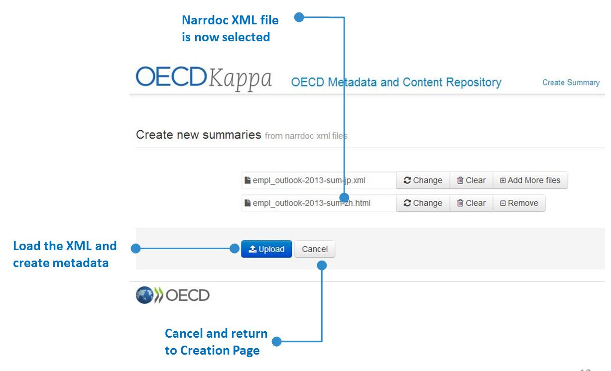

View and update summary metadata and files
------------------------------------------

Work, Expression and manifestation levels

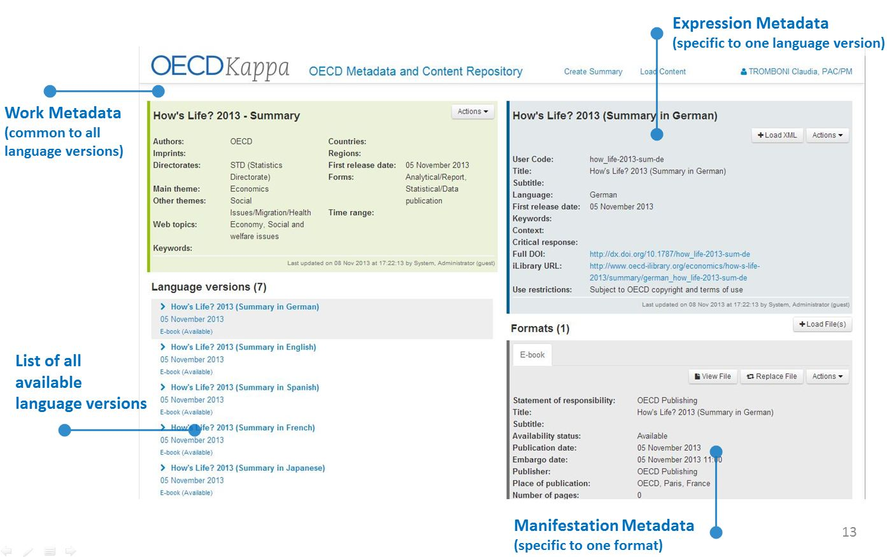

Work level: Intellectual content metadata 

Functions at Work level: Edit, Add, Mass update, Delete

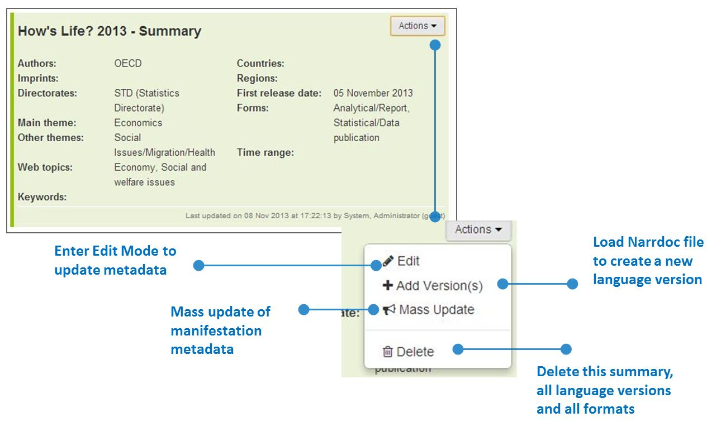

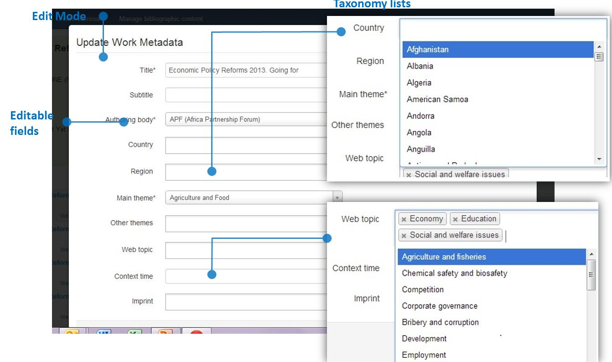

Expressions: Language version metadata 

Functions at Expression level: View, Replace, Edit, Delete

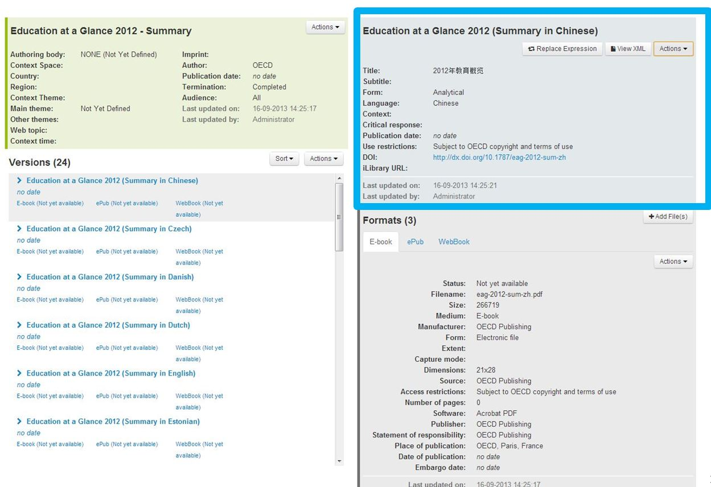

List of language versions

All expressions are listed in the Kappa UI. For each entry the following info is displayed:

* Language version title in English
* Date of first publication
* Format and availability status

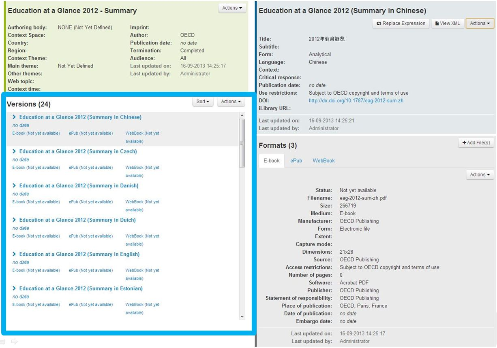

Manifestation level: Intellectual content metadata 

Functions at Manifestation level: View, Edit, Replace, Mass update

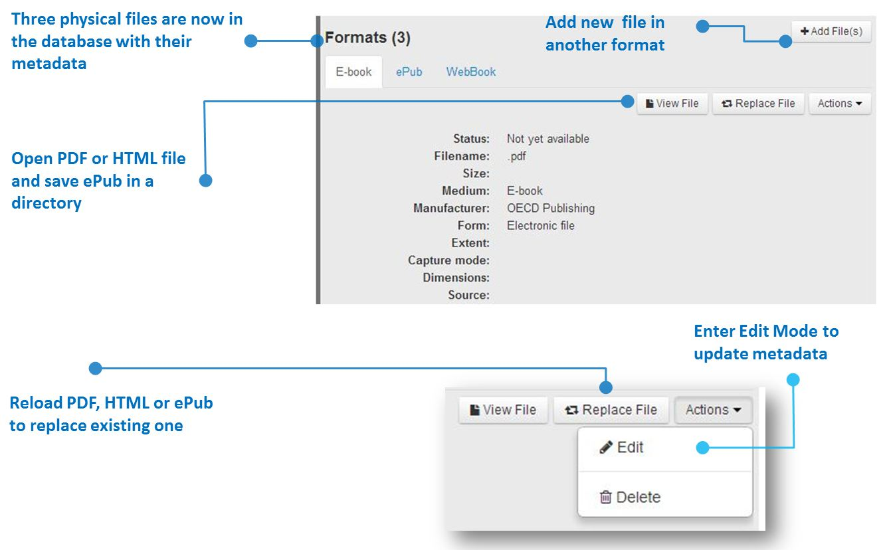

Add new formats for a given language version
---------------------------------------------
 
Business Rules

* You can add all formats for all languages at the same time
* Files need to be named with the DOI of the summary to which they belong to be associated with the correct records
* At loading the status is 'not yet available'

Example : 

* empl_outlook-2014-sum-fr.html for the French version in HTML of the employment outlook 2014
* agr_outlook-2013-sum-it.pdf for the Italian version of the agricultural Outlook 2013 in pdf
* 9789264183896-sum-es.epub for the spanish version of Health at a glance Europe 2012 in ePub

Procedure

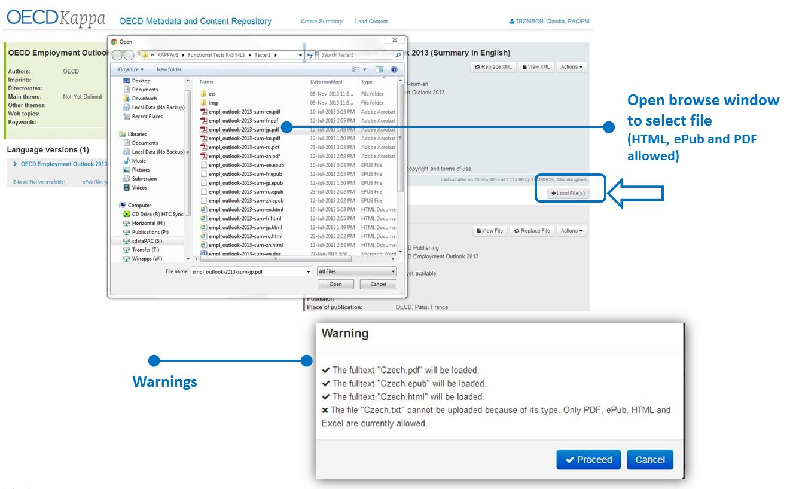
 
 

Add new formats by batch (for multiple summaries in multiple languages)
-----------------------------------------------------------------------
 
 .. image:: images/ML-add-batch.JPG
 

Mass metadata update
---------------------

At work level you can modify by batch the availability status, publication date and embargo date.
You can apply it to all language versions and formats or select some of them

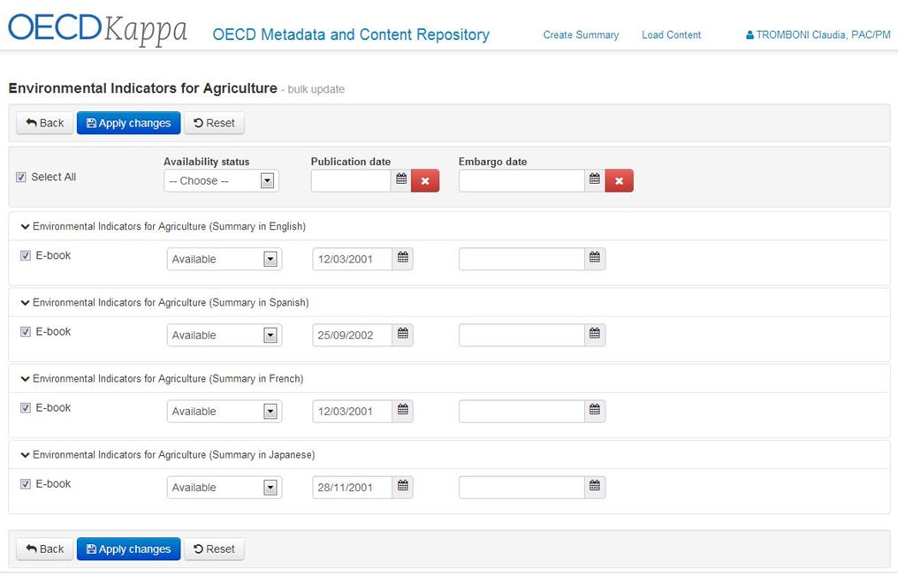