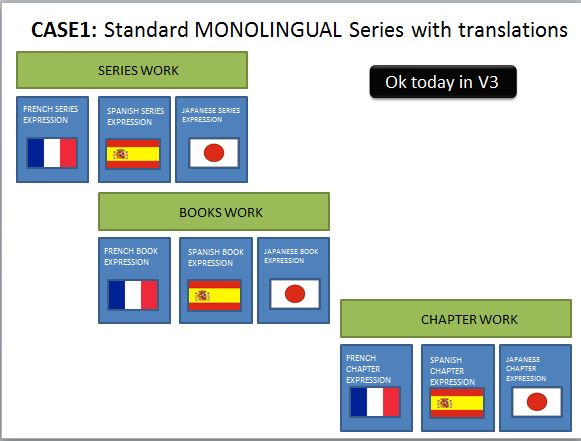
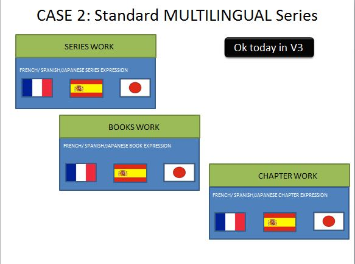
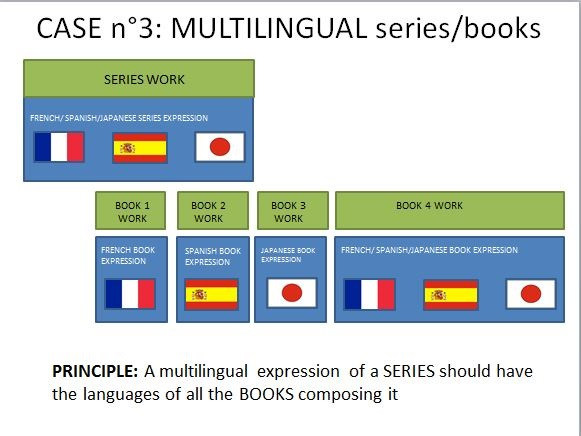
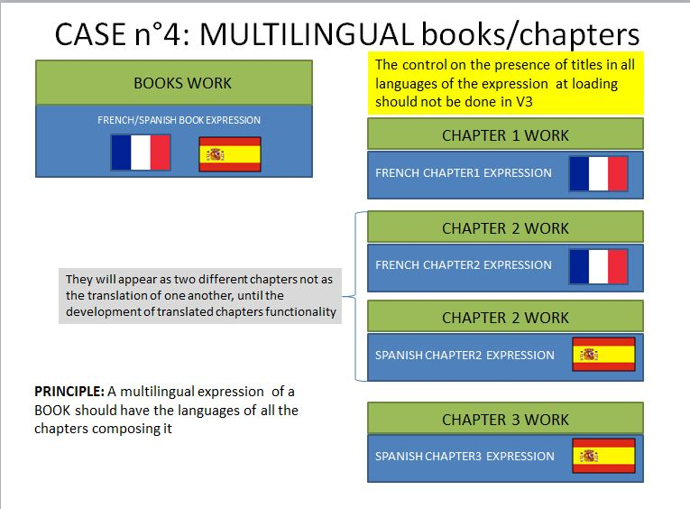
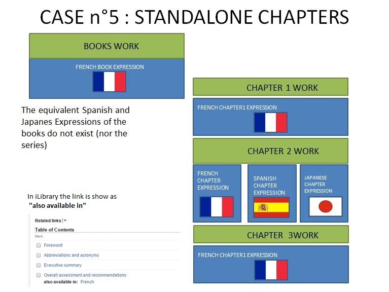
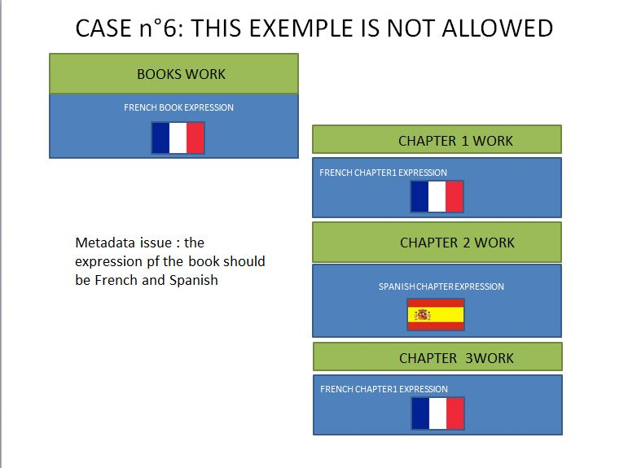
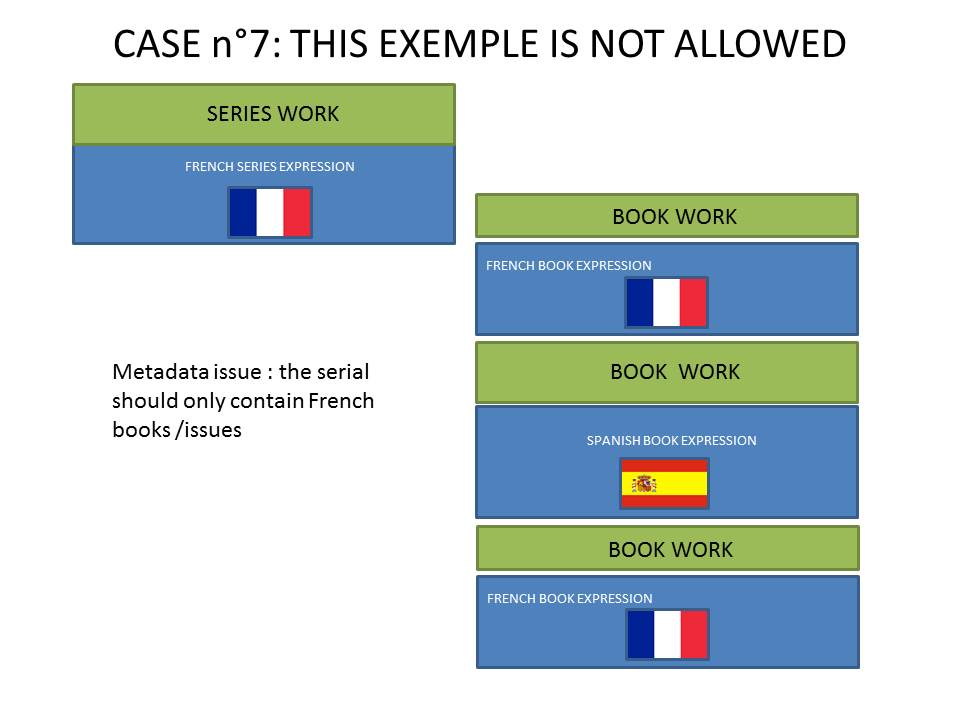

Multiple languages management
==============================
This is a list of all the possible multilingual combinations of metadata and an explanation of how they are handled in Kappa

Monolingual object with translations
------------------------------------

This is the easiest case possible. It corresponds to the simple Work - one or more expressions - manifestation 

We have a series that exists in several languages, and each Language version contains books 
and chapters in its same language

Standard multilingual objects
------------------------------

This case is almost identical as the first one, the only difference is that the object does not have an expression per language, but
it is multilingual (for example a book which is in English and French).

All of its components are also multilingual (in the same languages).

Multilingual object with different language children
-----------------------------------------------------

**Example 1** : Multilingual series with different language books

This case is very common in UN books for example. 

A multilingual series contains books in one of the languages of the series. 
Not all of the books are in all of the languages of the series.

**Example 2** : Multilingual books with different language chapters

Same case but at book/chapter level. The book is declared multilingual but some of its chapters are in one of the languages 
of the book only.

Standalone chapters or papers
------------------------------

A standalone chapter or paper is the translation of an existing chapter or paper.

For example if a book is in English, the chapter referring to France can be translated in French as well.

In this cas the chapter will exist in English (language of the book) and also in French (the book in French does not exist, just this chapter)

See also :doc:`Working papers business rules </WorkingPapers>`

Objects with language not present in the expression
----------------------------------------------------

This case is currently present in the UN publication but it is a metadata problem and should not be allowed.
This case also appears in Working papers language exceptions.

