OECD Observer Articles
========================

As from 2016, Observer articles are published online (in PDF and HTML format) in iLibrary as well as in other channels, 
independently of print issues.
A new publishing process is put in place, involving different systems and Kappa is one of them.

Observer articles publishing process
------------------------------------

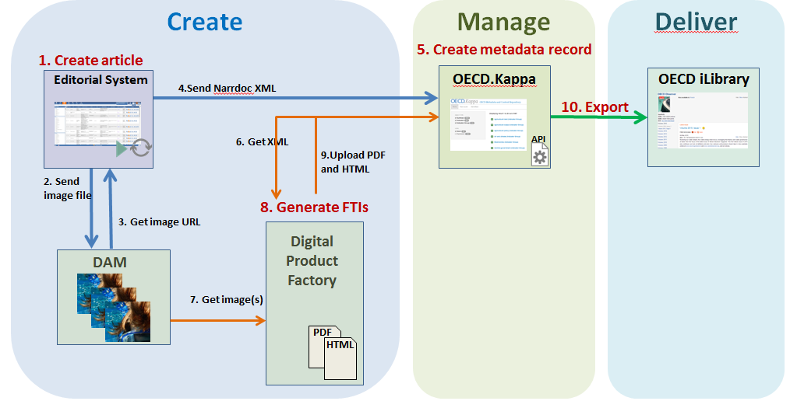

Search and filter
--------------------

To easily search for Observer articles in Kappa, use the facets ``Work`` and ``Catalogue types`` on the homepage:

Filter by 

Work type = **Paper**   

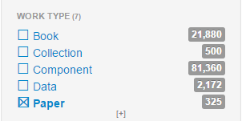

Or by 
Catalogue type = **Article**    

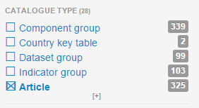

Create metadata record
---------------------------

The creation of an article's metadata record in Kappa is made **automatically** once the editors launch the export of 
the article from the Editorial System.

At this stage, Kappa creates the Work and the Expression (based on the article's language) metadata records of the article. 

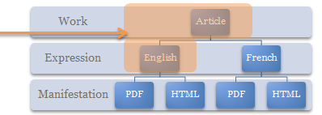

.. note:: Creation rule into Kappa: the article in EN must always be created first in Kappa.  

The translated article FR, when exported from Editorial System, is attached to the sameWork than the article EN, and the 
Expression FR is created. 

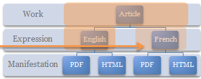

View article metadata (Work, Expression, Manifestation)
---------------------------------------------------------

Once the article is created, the user can only view its metadata that come from the XMS imported from the editorial system

**Work metadata: Automated Creation**

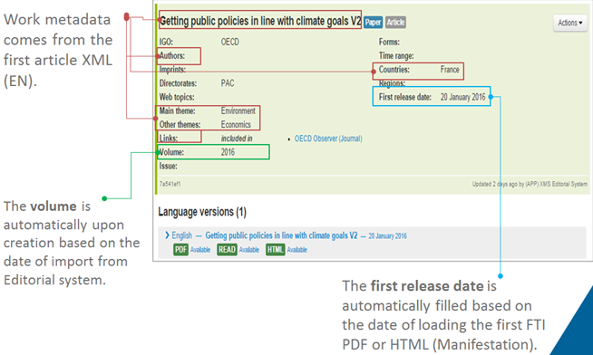
  
   

**Expression metadata (EN and FR): Automated Creation**

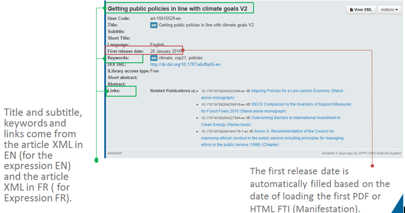
  

   

*Manifestation metadata (PDF and HTML), Automated Creation**

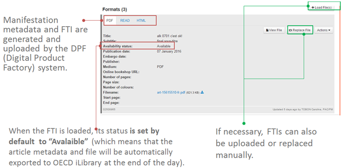

Edit article metadata (Work , Manifestation)
-----------------------------------------------

**Work metadata**

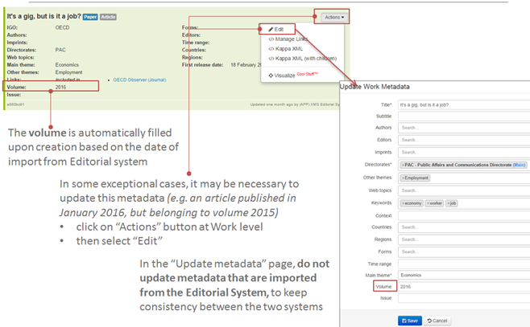

**Manifestation metadata**

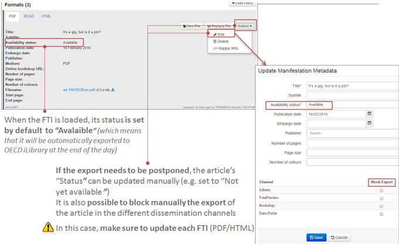

Find an article language version's identifier (Expression ID)
-------------------------------------------------------------

Search for the article in Kappa, e.g. search by title

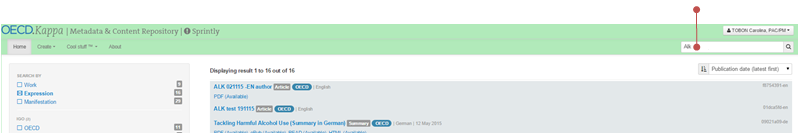
    
   
Follow the relevant search result to navigate to the article. Expression ID is the last part in the URL.

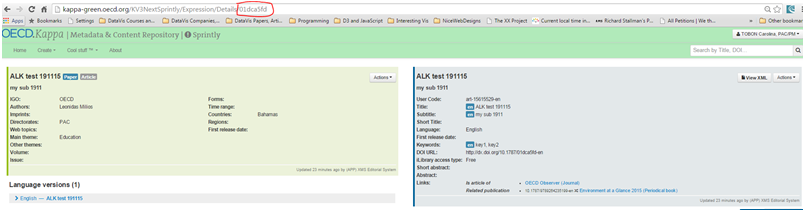

Add new FTI (PDF or HTML) manually
-------------------------------------

If there are no FTIs attached to the article's manifestation, click on Load and select the file (PDF or HTML) to attach

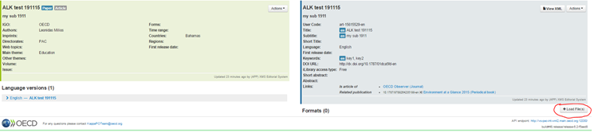

Kappa creates the relevant manifestation and loads the file

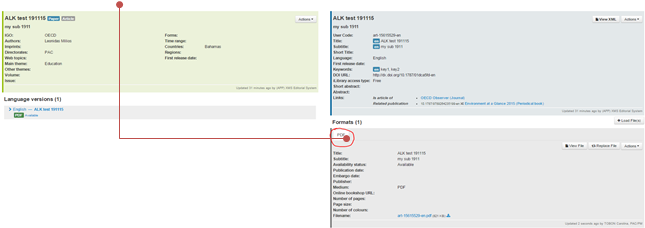

Replace an existing FTI (PDF or HTML) manually

If the FTI is being replaced, click on Replace file and select the file (PDF or HTML) to attach

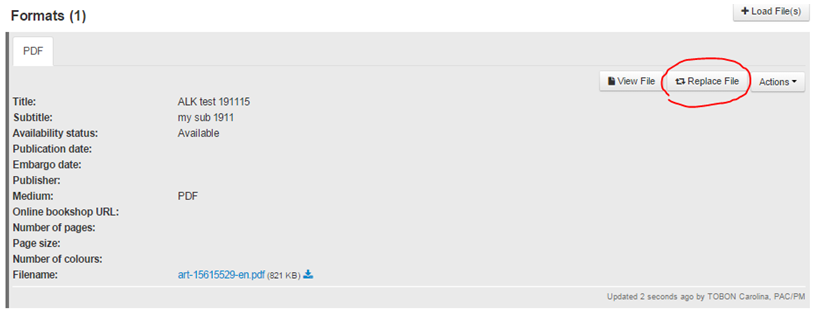