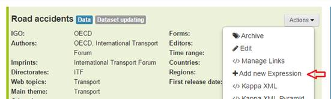
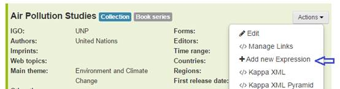

Release 8.1 - April 26th 2016
========================================

You will find the following new features :                                                                                                            

Migration of objects from Kappa V2:
During this first semester of 2016 we will continue migration all objects from Kappa V2 to Kappa
In the meantime,  all 1958 Articles present in Kappa V2 are now visible in Kappa V3 interface.

  .. image:: images/8_1-img1.png

Reports :
---------

As announced in the last version, the reports are now accessible via the interface. Just click on the Reports Tab. 
We have also added a new report on missing files.

 .. image:: images/8_1-img2.png

Interface :             
-----------

It is now possible via the interface to add a new language version of  any existing object fully managed by Kappa interface (databases, datasets and  IGO serials, and books).
Just use the Actions menu at work level in the detailed page of the object.

 

 

Data Objects:
--------------

Specific enhancement for Data objects include :

*	CSV file of dataset archives automatically  assigned at loading a status of availability 'available' 
*	Clean up of Dataset archives links
*	Discontinued dataset editions are now eligible for export to iLibrary

Metadata for IGOs:
-------------------

Specific developments for IGO management include:

*	Scripts to verify XMLs and PDFs prior to batch loading in Kappa
*	Possibility to add a serial translation via Excel file
*	Possibility to create a translation of a book without chapters even if the master language is published in chapters

Preparation of iLibray iteration 6 :
-----------------------------------

*	Possibility to load at manifestation level an XLSX format file, and to export it on OECD iLibrary. 

The new practice in place is that a manifestation file can either be XLS or XLSX format, but the two formats cannot coexist for the same manifestation.

Detailed communication to specific end-users and an updated user guide will follow shortly.
Should you need any further explanation or if you wish to have a demo, please do not hesitate to contact KappaPOTeam@oecd.org

KAPPA PO team

**ITERATION 8 : ILIBRARY ITERATION 6 FULL UN ILIBRARY**

Sprint 8.1
-----------

26 Apr 2016
46 issues   (46 closed - 0 open)

*  User story #10644: Article V2 migration
*  User story #11084: Edition des métadonnées peri et coll
*  User story #11091: Ajout des chapters/sections dans un book UN loadé sans découpage
*  User story #11093: Suppression d'un book jamais exporté
*  User story #11177: XLSX format
*  User story #11178: CSV file of dataset archives automatically set available
*  User story #11182: Report : manifestation without a file attached to it
*  User story #11183: Show reports on the UI
*  User story #11185: Loading.xsd Editor to be added in chapters
*  User story #11188: Scripts de chargement pour Laurent Ducreux (dry-run et real)
*  User story #11215: remonter les Counter-friendly URLs vers Kv3 (pour les objets Kv2)
*  User story #11249: Ajouter une expression à un work existant via le formulaire UI
*  User story #11250: ajouter une nouvelle expression de serial via le fichier excel
*  User story #11348: Ignorer le contrôle de TOC quand il n'y a pas de TOC
*  Technical story #10987: I want to delete an object with its dependancies in Kappa v3
*  Task #11072: Mise à jour du mapping Auteurs Individuels vers taxonomie person
*  Task #11098: Wrong Work Type
*  Task #11119: corriger les titres qui commencent avec un espace
*  Task #11144: delete Norden indicators and indicator groups
*  Task #11189: Add periodicity to taxonomy
*  Task #11194: Loading de series UN dans nightly
*  Task #11196: Add Language column in Marketing Report
*  Task #11204: When UN is selected in creation form, themes should be UN themes
*  Task #11232: Add Missing fields to PIM API
*  Task #11270: Enumerations ID are generated with a / instead of :
*  Task #11294: Ajouter ITU à la taxonomie IGO
*  Task #11336: Deployer la Azurely
*  Scrum  Task #10971: Dataset archives with no ``is archive of link``
*  Scrum  Task #11089: Medium serials UN - correction
*  Scrum  Task #11116: Doublons Manifestation Read dans KV3
*  Scrum  Task #11170: Update serial eligibility criteria for ilibrary export
*  Scrum  Task #11171: Remove restrictions on ilibrary export for discontinued datasets
*  Scrum  Task #11205: Creation Form : Button create print manifestation generates a PDF instead
*  Scrum  Task #11233: Periodicity et number of issues per year
*  Scrum  Task #11364: search api for oecd.direct : mainTheme in result items
*  Scrum  Task #11379: Export non-regression testing
*  Scrum  Bug #11066: des entrées vides dans les manifestes des miniatures
*  Scrum  Bug #11175: Erreur quand on édite le title d'un dataset archive
*  Scrum  Bug #11210: Recherche par ISSN nightly
*  Scrum  Bug #11218: Editors are not saved after work edition in UI
*  Scrum  Bug #11229: UI results promises more than possible
*  Scrum  Bug #11329: Debug error messages appearing in PROD
*  Scrum  Bug #11342: Non existing Master language pour chapters quand on reloade un XML
*  Scrum  Bug #11347: Add Book Series to UN series report
*  Scrum  Task #11290: expressions of same languages could not be part of the same work
*  Scrum  Task #11365: search api for oecd.direct : thumbnails size