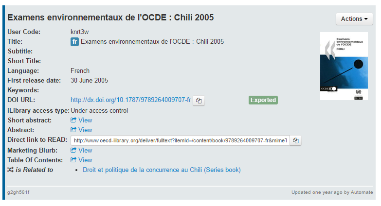
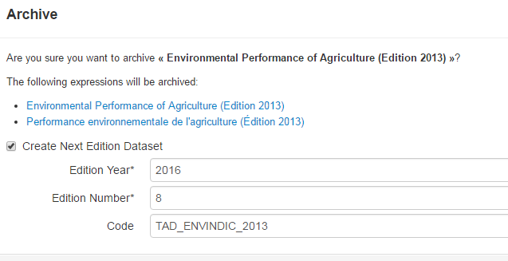

Release 8.2 - July 12th 2016
=============================

Dear all,

Nearly a month ago, the new UN iLibrary and the OECD iLibrary iteration 6 and were released.
As you all know, nothing is possible on iLibrary without the two Kappa Databases and all the 
export processes behind them.
On Kappa side, the team has worked very hard in preparing the last release but has also been 
able to develop quite a few new features.
Here is a very quick summary by subject, should you be particularly interested in a feature or need 
further explanation, please do not hesitate to contact  PAC Kappa Project Team.
A big thank you to all the people involved for the great effort and results

KAPPA PO team

New Application Features :
=============================

29 user and technical stories developed

21	bugs corrected

Published status
---------------------------

A new simplified status taxonomy has been put in place to separate commercial from bibliographic availability. A Kappa object will no longer be ``available``, but it will be ``published``
The list of values is now the following :

 .. image:: images/8_2-img1.png

A published object might have been exported or not,  you will clearly see it on screen 
 

On mouse over, you will be able to see when and where it has been exported

.. image:: images/8_2-img3.png

Export eligibility
---------------------------

For every object  you see in Kappa, you will be able to know if it is eligible to be exported to iLibrary. Just  select actions – Export Eligibility

.. image:: images/8_2-img4.png 

In the example,  this periodical book is not eligible because its parent serial is not eligible.

.. image:: images/8_2-img5.png
 

External link via the interface
---------------------------
      
You can now add a link to an external resource via the ``manage links`` form 

 .. image:: images/8_2-img6.png

Data
---------------------------

-	Title building rules for data : the title of the dataset group set as main parent is now included as a prefix to the archive dataset title.

-	Dataset Code for new editions : when you archive a dataset edition, you will be able to enter the code of the new edition

 

-	Latvia was added to Data Portal countries export

PIM
---------------------------

-	PIM conservation of ID : the manifestation ID is now conserved when an object is reloaded. This is very important for PIM which uses the manifestation ID to identify objects

IGO management
--------------------------------

-	The internal structure of the database has been adapted to support multiple IGOs
-	You can now load series by batch  for any IGO
-	UN bookshop link has been batch loaded and published on iLibrary

Usage tracking
---------------------------

-	We have started  to add some functionality to track usage. Tracking usage is very interesting as it will allow us to get some better idea of who is using Kappa v3, and to do what.

**ITERATION 8 : ILIBRARY ITERATION 6 FULL UN ILIBRARY**

Sprint 8.2
-----------

12 Jul 2016
49 issues   (49 closed - 0 open)

*  User story #9955: Dataset Code should be asked for new editions
*  User story #10936: Language versions and multilingual objects (2/2) - Standalone chapters
*  User story #11038: I would like to know whether an object is exportable in its current state
*  User story #11186: Publish UN bookshop link on iLIbrary (1/2)
*  User story #11187: Backlog Publish UN bookshop link on iLIbrary (2/2)
*  User story #11367: Brand and imprint management for iLibrary
*  User story #11368: Display of DOI link and iLibrary URL alias
*  User story #11369: Theme taxonomy and subject management
*  User story #11370: Rationalisation of periodicals
*  User story #11425: Title building rule for archiving datasets within a group
*  User story #11427: Loading des series d'autres IGO que UN
*  User story #11433: Update Keepeek export to cater for UN bookshop
*  User story #11436: UN translated serials to upload in KV3 Prod
*  User story #11522: Create ``Online`` manifestation to existing dataset archive
*  User story #11548: KV3 : Ordre des articles dans leur journal qui change quand un article est mis à jour (via l'editorial système)
*  User story #11550: Créer la taxonomie JEL Code
*  User story #11571: Conserver le Manifestation ID lors d'une suppression de manifestation
*  User story #11595: Migrer la métadonnée ``JEL code`` pour les objets KV2
*  User story #11596: Eliminer la métadonnée number of issues per Year
*  User story #11606: Add French translation of UN themes
*  User story #11607: Changes in the Availability Status Taxonomy
*  User story #11631: Matching records for citation cases (Iteration 6 testing)
*  User story #11694: Add an external link via the interface
*  Technical story #11223: Adapt internal structure to *  Support multiple IGOs
*  Technical story #11479: API key leaks
*  Technical story #11532: [NIGHTLY] search api : broken buyLink elements
*  Technical story #11558: Métadonnée Imprint: mapping kv2 vers kv3
*  Technical story #11641: expand il eligibilty property for xlink hassummary at expression level for iLibrary summaries export
*  Scrum  Task #8690: create more user-friendly error message for parse errors (specifically indicators)
*  Scrum  Task #11125: `DOITitle` et `DOISubTitle` pour titres UN
*  Scrum  Task #11213: A multilingual expression could not have the same language multiple times
*  Scrum  Task #11228: Présentation de l'export Kv3->KappaV3_Daily à 4DConcept
*  Scrum  Task #11291: Creation Form should filtered language drop down language list once a language is already selected in other expressions
*  Scrum  Task #11392: search times out when searching for certain special characters
*  Scrum  Task #11422: Add Latvia to Data Portal countries
*  Scrum  Task #11448: Recherche et filtrage de la sortie xsd de la taxonomie
*  Scrum  Task #11454: ajout du canal d'export OECD.org dans la partie Export Channel Management
*  Scrum  Task #11466: Ordre d'affichage des auteurs
*  Scrum  Task #11469: Réaliser un fork interne/ externe de la validation du loading
*  Scrum  Task #11507: Ordre des articles Observer
*  Scrum  Task #11519: Add publisher label and ISBN to book report
*  Scrum  Task #11536: Deploy Exportly for IL Testing (iteration 6)
*  Scrum  Task #11545: a faire avant le deploiement : ne plus ecraser les utilisateurs dans la base live
*  Scrum  Task #11584: iLibrary export of indicators: add new data attribute (data-editable) in the 
 contained in the <preview> element
*  Scrum  Bug #11393: missing information in export channel block of manifestation
*  Scrum  Bug #11556: Wrong language assigned to stand-alone chapters
*  Scrum  Bug #11570: iLibrary error during schema validation
*  Scrum  Bug #11700: full translation loaded in a language for which a chapter Exists as a standalone translation
*  Scrum  Bug #11782: Perte des xlinks pour les objets V2
