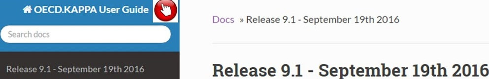
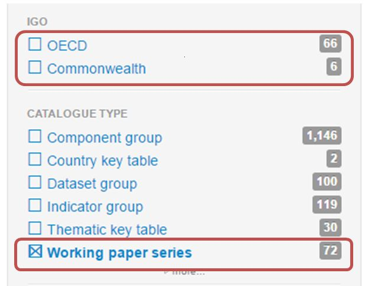
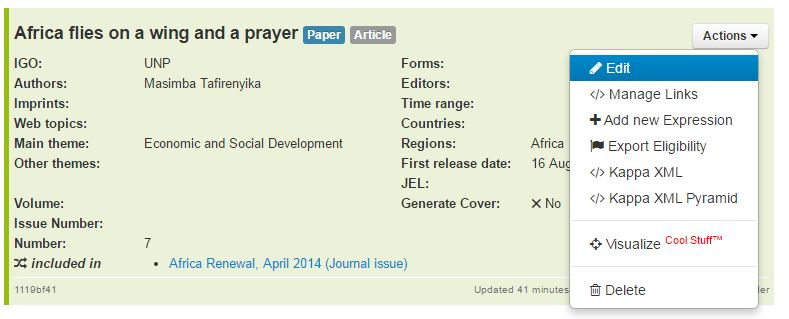
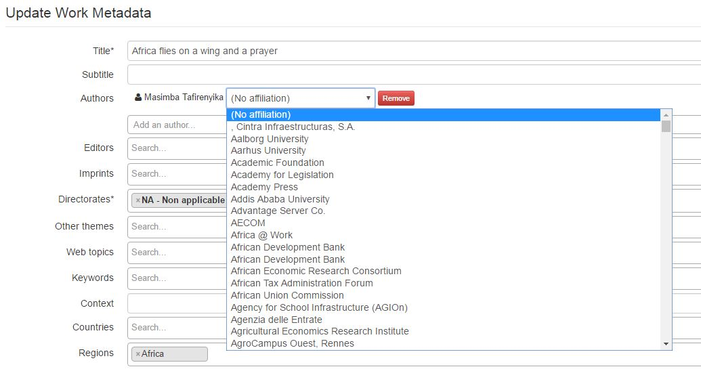
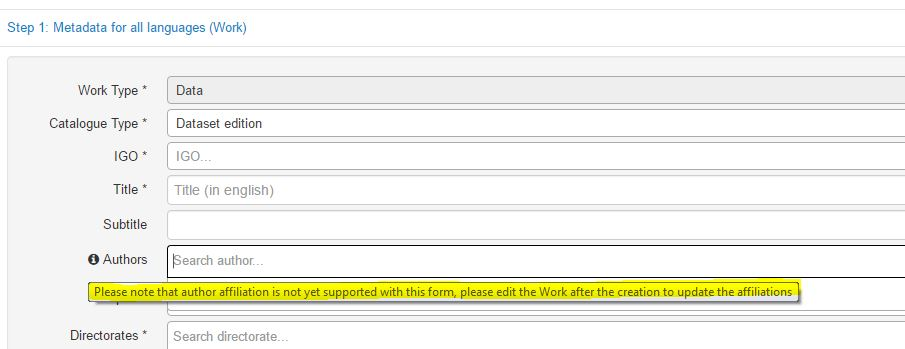

Release 9.1 - September 19th 2016
=====================================

Dear all,

First of all welcome to the new Kappa User Guide!

Once you have finished reading about all the exciting new features of this release, please click on Kappa User Guide, 
explore it and let us know your feedback et KappaPOTeam@oecd.org

Today we release a new version of Kappa, release 9.1.

Here is a very quick summary of the new features by subject, should you be particularly interested in a feature or need 
further explanation, please do not hesitate to contact  KappaPOTeam@oecd.org

To everybody in the team, you developed a lot of new features during the summer limited ressources :

New Application Features :
=============================

Working papers migration model and migration
---------------------------------------------

This iteration is focusing on the retirement of the Working papers database which will take place at the end of the next release.

In the mean time you will find working papers and working papers series in Kappa interface.

We migrate them every night from WP to Kappa

This migration involves quite a big evolution in the database :

* Kappa author's model has evolved to cater for affiliation, a very important efature for working papers 

 .. image:: images/Individual_authors_and_affiliations__for_working_papers.jpg

You will see the affiliation in the edition window of a work

If an affiliation is present you can remove, otherwise you can add it by selecting an organization in the drop-down list

.. note:: The affiliation is not yet supported in the creation form, you have to create the record first and then edit the work

 

We have developed and are ready to export Working papers to iLibrary, FreePreview and RePEc and the process to generate generic covers has been put in place.

Once everythign is setup, we will retire the old database (expected mid October)

IGO
-----

* ITU publication shave been loaded and tests on ITU iLibrary are ongoing
* We have added Keywords and JEL code for books in the metadata loading schema
* ISSN is now editable in th interface after creation via form
* We have added these two reports to facilitate exchanges of authors id with tagging subcontractors
	* List of all persons in Kappa taxonomy (this report can be used to send the persons id available for metadata tagging)
	* List of all organizations in Kappa taxonomy (this report can be used to send the organizations id available for metadata tagging)
* The Loading schema for working papers is ready to be delivered to subcontractors for IGO working papers

Data
-----

* The Loading schema for Data Objects (Databases, Datasets and dataset Groups is is ready to be delivered to subcontractors for NCM data objects

Other issues
-------------

* Availability status under embargo has been removed from the taxonomy

