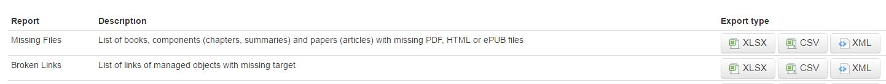

Release 9.2 - November 28th 2016
================================

Today we release a new version of Kappa which includes all the working Papers and Working paper Series lifecycle.
All the basic features are live, so the Working papers application can now be retired!

We reduce the number of databases and concentrate all our published objects in Kappa.

Working papers can now benefit from all the features present in Kappa for all objects like:
- embargo management
- cross reference linking : you can add a related publication to a working paper iLibrary page

More improvements will come before the end of the year thanks to users feedback.
Please feel free to suggest new needed features on 
`the dedicated redmine space <https://pacps01.oecd.org/redmine/projects/kappa-feature-and-change-requests/issues>`_

If you are interested in all the steps of the lifecycle of a working paper on OECD Kappa, please see the User Guide specific pages on working papers

:doc:`WorkingPapers`
--------------------

Decommisioning a whole database and all of its ecosystem processes has been a huge work, but we have had some time to improve and develop features
for current Kappa users

Interface changes :             
--------------------

The former Interface had facets on the left column but was reported not to be very readable on small screens.

In the new version all facets are at the top of the screen.

You will find an interesting new facet which calculates eligibility criteria (as of day-1 export, not the live update)

.. image:: images/Eligibility.JPG

you can also run a search using facets and download the XML of the result

.. image:: images/GetResults.JPG

Data Objects:
--------------

* The loading schema and process for Databases, Dataset Groups and Datasets is in place and it can be used to create records for OECD and IGO data objects
* Related Periodical link has been extended to publications and is now called **Featured Publication** for more information see see :doc:`Links`

Metadata for IGOs:
-------------------

* The loading schema and process for Series is now in place and we should retire the old Excel to XML process as soon as possible. The full XML chain is in place for IGOs. 
* You can now Edit all metadata fields in the interface for series, books and components

Reports :
---------

We have added a new quality control report on links : List of Kappa links with missing target

**List of all 88 issues treated**
=================================

User stories (44)
-----------------

* User story #10554: user interface - long running operations
* User story #11417: search api for oecd.direct : add "COUNTER friendly" READ URL
* User story #11608: Ajout de la Metadonnés "distributeur" et nettoyage ID publisher/Distributor
* User story #11821: Product tour
* User story #11858: Working Paper/Series export to iLibrary
* User story #11860: Working Paper export to FreePreview
* User story #11861: Working Paper generic cover generation
* User story #11867: Validation/Update of KV3 to iLibrary export document
* User story #11891: Working Paper/Series export to RePEc
* User story #11981: Make author a mandatory value
* User story #11982: Add affiliation to loading.xsd
* User story #11986: Loading Process for Working papers
* User story #11987: Mise en production de la release 9.1
* User story #11988: Creation of Working paper series from the interface
* User story #11989: Creation of Working paper from the interface
* User story #12002: Migrate JEL taxonomy export from WP Database to KV3
* User story #12034: Golive checklist for Working paper retirement
* User story #12036: Injection of OECD Observer articles without author
* User story #12038: Data loading schema: make work metadata optional when loading Dataset or Dataset Group
* User story #12040: Data Objects should have form = statistics
* User story #12050: Find related links in Kappa V2 which point towards Working papers
* User story #12051: Objects with no date should not appear first when sorting by date (latest first)
* User story #12068: Adding the country label to the affiliation in working paper iLibrary exports and generic covers
* User story #12070: Review XMl loading schema to add availability status
* User story #12071: Open Epression and Manifestation Edition UI for IGO books
* User story #12074: New ID at all pyramid levels to store legacy or other alternative IDs
* User story #12104: Loading Schema for series
* User story #12113: Add 'form' facet on home page
* User story #12116: Migration Working papers withdrawn
* User story #12122: Loading multiple formats of books / chapters
* User story #12124: Hide Keywords at work level then remove them
* User story #12126: Open edition for Working paper series and Working papers
* User story #12127: Tester les exports des liens qui sont passés d'externes à internes
* User story #12128: Update Exportly to complete test on loading of databases/groups/sets via XML
* User story #12142: Add new Expression from form
* User story #12157: Report on broken xlinks
* User story #12167: Changes to Datasets for IGOs other than OECD
* User story #12197: Loading Process for XML series
* User story #12203: add Thumbnail for Working paper series
* User story #12241: Issues with XML loading of datasets
* User story #12247: No "Add file" for series
* User story #12256: Issues with XML loading of datasets (part 2)
* User story #12257: Loading schema : add optional item directorate
* User story #12268: DiscoveryChannel export Update
* User story #12287: ISSN should be an iLibrary eligibility criteria for Working Paper Series

Technical stories (10)
---------------------

* Technical story #11180: mettre en place des tests automatises des exports
* Technical story #12075: Migrate the COTE of working papers
* Technical story #12140: Refactor exports and allow for on-the-fly manifest generation from eligibility properties
* Technical story #12152: Extend KappaXML validation to scoped Taxonomies
* Technical story #12176: Proof of concept on User interface: complete rewrite in Javascript
* Technical story #12184: Décommision WP database : Environnement de test
* Technical story #12187: GoLive checklist : Export DOI dashboard
* Technical story #12188: Golive checklist: KV3 to KV3Daily
* Technical story #12262: remove champ "is ISSNL" de la manifestation
* Technical story #12282: datasets with deleted online manifestation remove all fti access on ilibrary

Tasks and bugs (33)
-------------------

* Scrum task #10562: user interface - hide unused fields
* Scrum task #11859: Migration of WP: rules for authors
* Scrum task #12041: Remove Jel code at collection level
* Scrum task #12161: Change Link Taxonomy: Related periodical link
* Scrum task #12166: Loading schema for Data objects: fields to add
* Scrum task #12225: Repec contact for CW papers
* Scrum task #12229: WP series and WP : make webtopic not mandatory
* Scrum task #12248: By default, paper series and papers shoudl be "Free"
* Scrum task #12271: Schema for series : make ISSN-L an optional value
* Scrum bug #11983: Line breaks in Table of contents removed (IGO loading from XML)
* Scrum bug #12016: Creation via XML loading : non-existing parent workid should block generation of record
* Scrum bug #12039: Data Loading : Webtopic and OnlineURL
* Scrum bug #12059: Creation form search on themes
* Scrum bug #12117: Encoding problem in loading file gives Marklogic error
* Scrum bug #12129: Data Loading : Directorate for IGOs
* Scrum bug #12165: Loading of data Objects : missing main parent/Default child
* Scrum bug #12168: Migration of Working paper series, issue with languages
* Scrum bug #12175: Nightly: edition of database NCM generates error
* Scrum bug #12227: Database dateOfPublication incorrectly imported preventing export eligibility
* Scrum bug #12239: User Interface Add Paper
* Scrum bug #12246: Strange behaviour of Authors module on interface
* Scrum bug #12249: Metadata series with cover : behaviour from interface
* Scrum bug #12250: Control on existing parent series not working
* Scrum bug #12251: Series with cover: behaviour when loading via XML
* Scrum bug #12252: XML Creation of bilingual series : error message uncomprehensible
* Scrum bug #12259: XML series : Loading several times the same XML generates a different work each time
* Scrum bug #12260: Impossible to generate a bilingual series
* Scrum bug #12261: XML series : subtitle is not mapped
* Scrum bug #12263: ml search pagination does not work as expected
* Scrum bug #12264: thumbnail not showing on frontend (on nightly)
* Scrum bug #12265: product tour hiccups
* Scrum bug #12286: Problème de métadonnées sur des working papers/wp series
* Scrum bug #12289: Remonté d'erreurs incorrecte dans le script de validation du build de la Nightly
