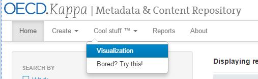
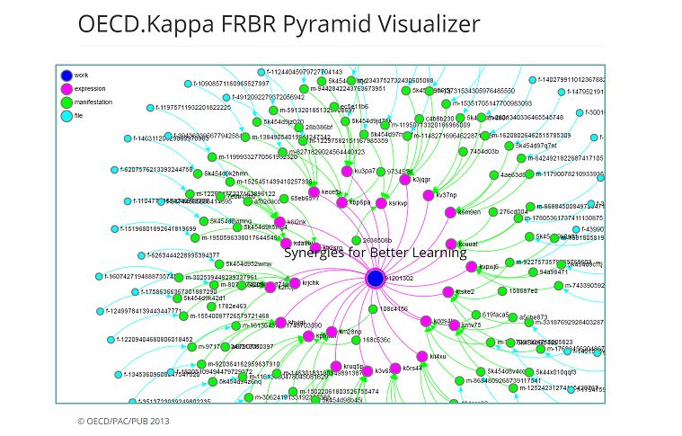
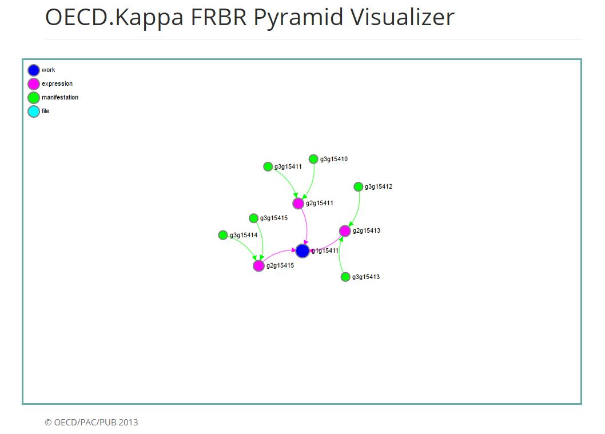

Visualize the FRBR pyramids
============================

In the user interface you will be able to see a visualization of the FRBR model.
You can either open it frm the home page top tab

you will be able to see a complex example of pyramid corresponding to a the multilingual summary
`Synergies for better learning <http://kappa.oecd.org/v3/Work/Details/91201302>`_  with its 24 language versions
each in three formats (HTML, PDF and ePub)

If you wish to visualize the pyramid of a particular object, just go to the detailed page 

you will be able to see the pyramid

