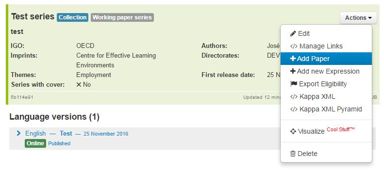
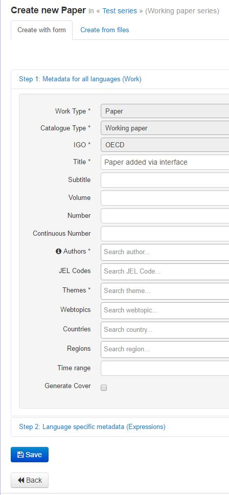
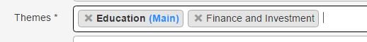
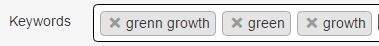
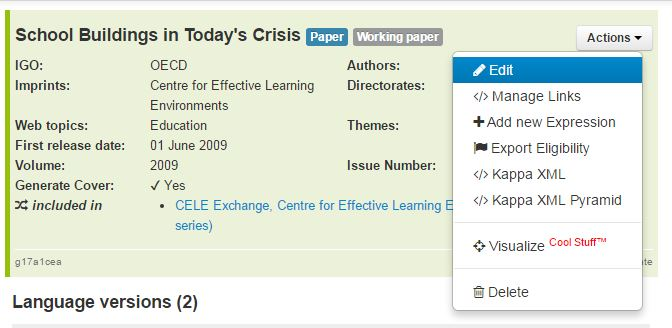
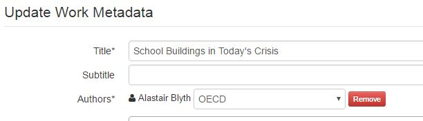
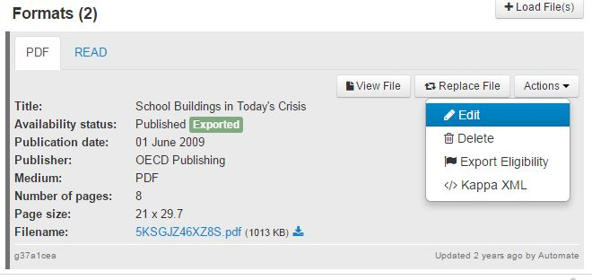

How to add a Working paper series using the WEB form
====================================================

To create a working Paper record you need to go to the series Detailed page.

On the Top left, click on Actions--> Add paper

The creation window opens, and you can select to create the paper using a form or an XML file

Creation from XML
-----------------

Please refer to :doc:`WPloadingprocess`

Creation from Form
--------------------

The first two metadata are there for you to know which kind of object you are creating. They have default values and cannot be modified.

* **Work Type** : this value is Filled by default with the value ``Paper``
* **Catalogue Type** : this value is Filled by default with the value ``Working Paper``

.. note:: To know more about work types and catalogue types see :doc:`BibliographicModel`

* **IGO** : select from the list the IGO for which you are entering the paper. At the moment Kappa handles OECD and Commonwealth paper.
* **Title** : Enter the title. If an English paper exists, pleas enter title in English
* **Subtitle**: Enter the subtitle. If an English paper exists, pleas eneter subtitle in English

**Paper Numbering**

Working papers are either numbered with a year and a number in that year (2017/1; 2016/22) or with a continuous number across all years (285, 286,...)
In the first case fill ``Volume`` and ``Number``; in the second case fill ``continuos number``

*  **Volume**: equivalent of the year int he numbering of the paper
* **Number**: number of the paper in the corresponding volume year
* **Continuous Number**: incrementing number which runs across all years

* **Authors** : This field contains both persons and organizations. Select the author by searching in the taxonomy (type 3-4 letters minimum.To add the affiliation you have to finish the creation process and go to the detailed page of the paper.
* **JEL Codes**: select the appropriate JEL code from the list.
* **Themes** : Select a theme from the list. The first theme will be the main theme and it will appear in bold. You can change the order of the themes 
by simple drag and drop 

* **Webtopics** : Select a webtopic from the list corresponding to the theme provided by Editorial, by using the table of equivalence

	* If only one WEB topic corresponds to the theme, select it.
	* If several WEB topics correspond to the theme and that no instruction are provided by Editorial, please contact PAC Metadata.
	* No web topic for IEA, NEA and ITF publications.

+--------------------------------------------+------------------------------------------+
|   Web  Topics                              |   iLibrary Themes                        |
+============================================+==========================================+
|   Agriculture and Fisheries                |   Agriculture and Food                   |
+--------------------------------------------+------------------------------------------+
|   Competition                              |   X                                      |
+--------------------------------------------+------------------------------------------+
|   Development                              |   Development                            |
+--------------------------------------------+------------------------------------------+
|   Economy                                  |   Economics                              |
+--------------------------------------------+------------------------------------------+
|   Education                                |   Education                              |
+--------------------------------------------+------------------------------------------+
|   Employment                               |   Employment                             |
+--------------------------------------------+------------------------------------------+
|   Industry and Entrepreneurship            |   Industry and Services                  |
+--------------------------------------------+------------------------------------------+
|   Tax                                      |   Taxation                               |
+--------------------------------------------+------------------------------------------+
|   Trade                                    |   Trade                                  |
+--------------------------------------------+------------------------------------------+
|   Regional, Rural and Urban Development    |   Urban, Regional and Rural Development  |
+--------------------------------------------+------------------------------------------+
|   Social and Welfare Issues                |   Social Issues/Migration/Health         |
+--------------------------------------------+                                          +
|   Health                                   |                                          |
+--------------------------------------------+                                          +
|   Migration                                |                                          |
+--------------------------------------------+------------------------------------------+
|   Finance                                  |   Finance and Investment                 |
+--------------------------------------------+                                          +
|   Investment                               |                                          |
+--------------------------------------------+                                          +
|   Insurance and Pensions                   |                                          |
+--------------------------------------------+------------------------------------------+
|   Environment                              |   Environment                            |
+--------------------------------------------+                                          +
|   Chemical Safety and Biosafety            |                                          |
+--------------------------------------------+                                          +
|   Green Growth and Sustainable Development |                                          |
+--------------------------------------------+------------------------------------------+
|   Science and Technology                   |   Science and Technology                 |
+--------------------------------------------+                                          +
|   Internet                                 |                                          |
+--------------------------------------------+------------------------------------------+
|   Public Governance                        |   Governance                             |
+--------------------------------------------+                                          +
|   Regulatory Reform                        |                                          |
+--------------------------------------------+                                          +
|   Corporate Governance                     |                                          |
+--------------------------------------------+                                          +
|   Bribery and Corruption                   |                                          |
+--------------------------------------------+------------------------------------------+
|   Innovation                               |   X                                      |
+--------------------------------------------+------------------------------------------+
|   X                                        |   Transport                              |
+--------------------------------------------+------------------------------------------+
|   X                                        |   Energy                                 |
+--------------------------------------------+------------------------------------------+
|   X                                        |   Nuclear Energy                         |
+--------------------------------------------+------------------------------------------+	
	
	
	
	
* **Countries** : If necessary select a country from the list. You can type a few letters to search in the long list
* **Regions**: If necessary select a region from the list. you can type a few letters to search in the long list
* **Time range** : not applicable for the moment
* **Generate Cover** : if checked, a generic cover will be generated for the paper

Now click on  ``Step2.Language Specific Metadata (Expressions)``
The second section of the Form you see is the part concerning the Expression, so the language dependent metadata.
You will have to create a language version for each paper.
* **Title** : Enter the title of the paper, according to the form decided upon by Editorial
* **Subtitle**: Enter the subtitle of the paper, according to the form decided upon by Editorial
* **Short Title** : Used for search engines and mobile devices, this short title is not mandatory
* **Keywords** : Type the keyword and press enter. Pressing enter will delimit the word 

In the following case first I have typed green growth + enter and in the second case green + enter , growth + enter

* **Abstract**

* Create PDF Manifestation

If applicable, create record for other language versions of the WP paper clicking on ``Add new Language`` and restart Step 2 for the second language.

When you are done, click on  

You will see a confirmation message with the links to the records you have created
Click on the link and go to the paper detailed page :

Click on Action--> edit at Work level to add the affiliation if necessary

Click on Action--> edit at manifestation (bottom right grey part) level, change the status to ``published`` and add a publication date

