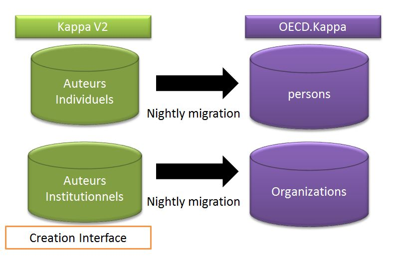
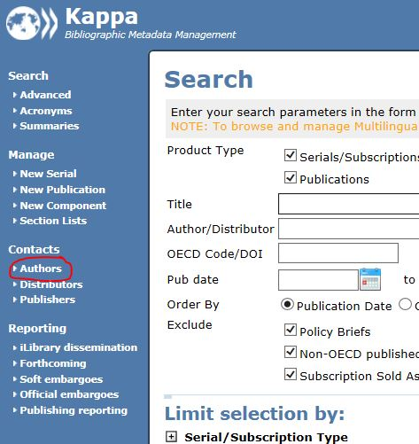
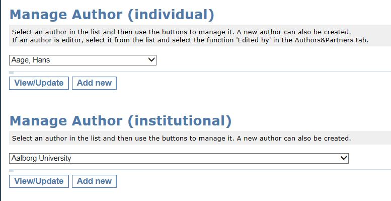

Authors and affiliation management for a working paper
----------------------------------------------------------------

At the moment Kappa V2 is the master database for authors. This means that all authors from Kappa V2 are migrated every night to OECD.Kappa

When you receive a Working paper, you should check that the author exists in Kappa V2

To do so, please go to http://pac-apps.oecd.org/kappa/search/search.asp

Select authors

Then search either the person or the organization in the list.

If you do not find the author, please contact pacmetadata@oecd.org

.. warning:: You have to wait for the day after for the new author to arrive in OECD.Kappa, so please take enough time to look at the authors as soon as you receive a working paper

Once your author is created you can proceed to STEP 3: :doc:`WPAddPaper2Series`
