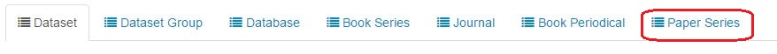
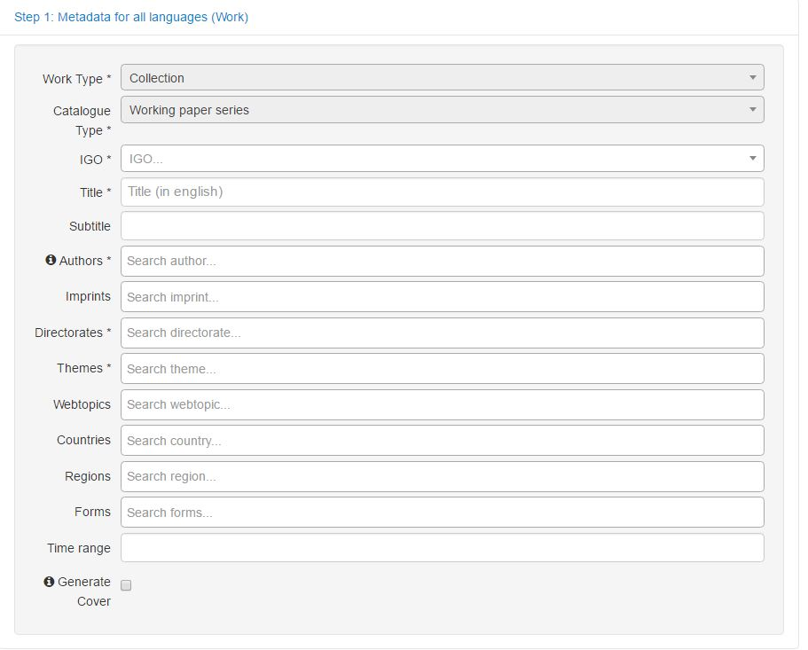
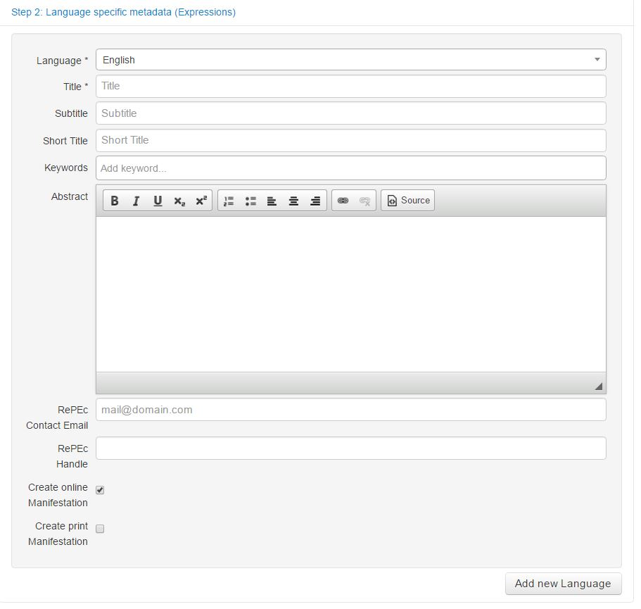
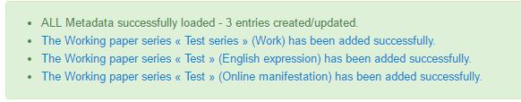
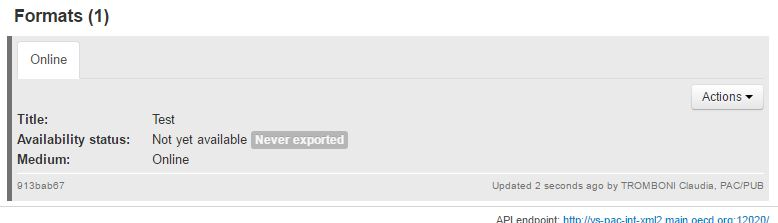
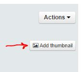

How to create a Working paper series
--------------------------------------

From Kappa Top Menu, select Create from form 

.. image:: images/CreationTab1.JPG

Then in the selection Tab, choose Paper series

The creation form will open.
The first section of the form contains the metadata applicable to all languages and all format versions of a series.
They are mainly language independent indexing metadata like the theme or the country.

Enter all metadata according to the checklist below

The first two metadata are there for you to know which kind of object you are creating. They have default values and cannot be modified.

* **Work Type** : this value is filled by default with the value ``Collection``
* **Catalogue Type** : this value is filled by default with the value ``Paper Series``

.. note:: To know more about work types and catalogue types see :doc:`BibliographicModel`

* **IGO** : select from the list the IGO for which you are entering the series. At the moment Kappa handles OECD and Commonwealth paper series.
* **Title** : Enter the title. If an English series exists, pleas enter title in English
* **Subtitle**: Enter the subtitle. If an English series exists, pleas eneter subtitle in English
* **Authors** : This field contains both persons and organizations. If the series is an OECD (or Commonwealth) series, please type OECD (or Commonwealth Secretariat) select the value from the list and enter.
* **Imprints** : Select an imprint from the list if it is applicable
* **Directorates** : Select a directorate from the list if it is applicable. For non OECD series, select ``NA: not applicable``
* **Themes** : Select a theme from the list. The first theme will be the main theme and it will appear in bold. You can change the order of the themes 
by simple drag and drop 

.. image:: images/themeMain.JPG

* **Webtopics** : Select a webtopic from the list corresponding to the theme provided by Editorial, by using the table of equivalence

	If only one WEB topic corresponds to the theme, select it.
	
	If several WEB topics correspond to the theme and that no instruction are provided by Editorial, please contact PAC Metadata.
	
	No web topic for IEA, NEA and ITF publications.

+--------------------------------------------+------------------------------------------+
|   Web  Topics                              |   iLibrary Themes                        |
+============================================+==========================================+
|   Agriculture and Fisheries                |   Agriculture and Food                   |
+--------------------------------------------+------------------------------------------+
|   Competition                              |   X                                      |
+--------------------------------------------+------------------------------------------+
|   Development                              |   Development                            |
+--------------------------------------------+------------------------------------------+
|   Economy                                  |   Economics                              |
+--------------------------------------------+------------------------------------------+
|   Education                                |   Education                              |
+--------------------------------------------+------------------------------------------+
|   Employment                               |   Employment                             |
+--------------------------------------------+------------------------------------------+
|   Industry and Entrepreneurship            |   Industry and Services                  |
+--------------------------------------------+------------------------------------------+
|   Tax                                      |   Taxation                               |
+--------------------------------------------+------------------------------------------+
|   Trade                                    |   Trade                                  |
+--------------------------------------------+------------------------------------------+
|   Regional, Rural and Urban Development    |   Urban, Regional and Rural Development  |
+--------------------------------------------+------------------------------------------+
|   Social and Welfare Issues                |   Social Issues/Migration/Health         |
+--------------------------------------------+                                          +
|   Health                                   |                                          |
+--------------------------------------------+                                          +
|   Migration                                |                                          |
+--------------------------------------------+------------------------------------------+
|   Finance                                  |   Finance and Investment                 |
+--------------------------------------------+                                          +
|   Investment                               |                                          |
+--------------------------------------------+                                          +
|   Insurance and Pensions                   |                                          |
+--------------------------------------------+------------------------------------------+
|   Environment                              |   Environment                            |
+--------------------------------------------+                                          +
|   Chemical Safety and Biosafety            |                                          |
+--------------------------------------------+                                          +
|   Green Growth and Sustainable Development |                                          |
+--------------------------------------------+------------------------------------------+
|   Science and Technology                   |   Science and Technology                 |
+--------------------------------------------+                                          +
|   Internet                                 |                                          |
+--------------------------------------------+------------------------------------------+
|   Public Governance                        |   Governance                             |
+--------------------------------------------+                                          +
|   Regulatory Reform                        |                                          |
+--------------------------------------------+                                          +
|   Corporate Governance                     |                                          |
+--------------------------------------------+                                          +
|   Bribery and Corruption                   |                                          |
+--------------------------------------------+------------------------------------------+
|   Innovation                               |   X                                      |
+--------------------------------------------+------------------------------------------+
|   X                                        |   Transport                              |
+--------------------------------------------+------------------------------------------+
|   X                                        |   Energy                                 |
+--------------------------------------------+------------------------------------------+
|   X                                        |   Nuclear Energy                         |
+--------------------------------------------+------------------------------------------+	
	
	
	
	
* **Countries** : If necessary (this should not really be the case for series normally) select a country from the list. You can type a few letters to search in the long list
* **Regions**: If necessary (this should not really be the case for series normally) select a region from the list. you can type a few letters to search in the long list
* **Forms** : This is the nature of information of the content (Statistics, analysis, policies and advice)
* **Time range** : not applicable for the moment
* **Generate Cover** : if checked, a generic cover will be generated for the papers of the series, if unchecked no cover for the papers.

Now click on  ``Step2.Language Specific Metadata (Expressions)``
The second section of the Form you see is the part concerning the Expression, so the language dependent metadata.
You will have to create a language version for each series.

* Language : choose the language of the series you want to create

.. warning:: Kappa will not handle language exceptions, for example if a series contains mainly papers in English but at least one paper exists in French, then the series will have to be bilingual (see :doc:`WPTypes`)

.. note:: To know more about management of multilingual objects in Kappa see :doc:`MultipleLanguagesManagement`

* **Title** : Enter the title of the series, according to the form decided upon by Editorial
* **Subtitle**: Enter the subtitle of the series, according to the form decided upon by Editorial
* **Short Title** : Used for search engines and mobile devices, this short title is not mandatory
* **Keywords** : Type the keyword and press enter. Pressing enter will delimit the word 

In the following case first I have typed green growth + enter and in the second case green + enter , growth + enter

.. image:: images/keywordenter.JPG

* **Abstract**
* **RePEc Contact Email** This is the email that will be supplied to REPEC as their oecd contact. Enter the contact email of the author directorate (e.g. “agr.contact@oecd.org”).
* **RePEc Handle** : Every archive participating in RePEc needs a unique identifier, called handle. It is of the type RePEc:aaa, where aaa is a three letter string. You must request that a handle be assigned to your department or institution to ensure that there are no duplicates. To request a handle, please send an email to PACmetadata.
Note that there may already be a RePEc archive at your location. 
To see the current list of RePEc archives,  `see <https://ideas.repec.org/archives.html>`_ . 

* Create online Manifestation
* Create print Manifestation

If applicable, create record for other language versions of the WP series clicking on ``Add new Language`` and restart Step 2 for the second language.

When you are done, click on .. image:: images/save.JPG

You will see a confirmation message with the links to the records you have created

Click on the link and go to the series detailed page :

If you need to add a thumbnail for this series, you will see a button at expression level which allows you to load the image

Click on Action--> edit at manifestation (bottom right grey part) level, add the ISSN, 

When you attach the first working paper to the series, go to the same place (Action -->Edit at manifestation level) change the status to ``published`` and add a publication date

You are all ready to go to creating the authors (see STEP2: :doc:`WPAuthors`) or :doc:`WPAddPaper2Series`

