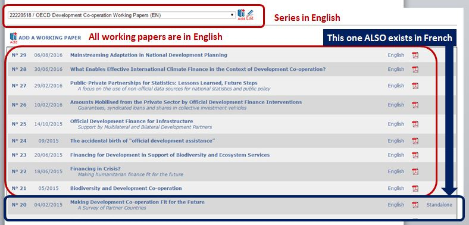
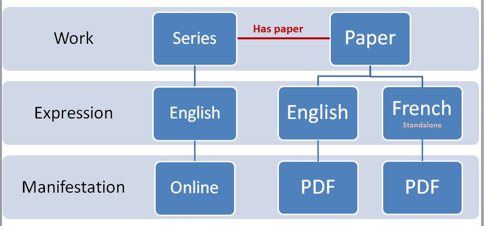
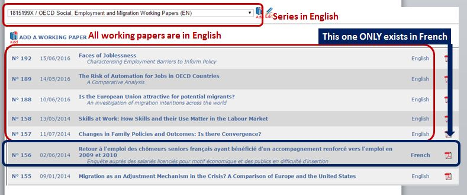

Types of Working papers
-----------------------------

The following types of working papers existed in the Working papers database

* Normal working papers
* Standalone translations
* Language exceptions

Norma working papers do not need an explanation, the series is in English or French and the paper is in the same language of the series.

Some working papers are translated into a second language, even if the series in that language does not exist, they are called standalone working papers

See the following example from the working Papers database :

In Kappa, the model is the following :

The case of a language exception is different because the paper does not exist in the language of the series, but only in a second language

See the following example from the working Papers database :

In Kappa this case is not authorized as is (see :doc:`MultipleLanguagesManagement`)

The series is transformed into a bilingual series at migration.

The model is the following :

.. image:: images/LanguageExceptionWPModel.JPG

:doc:`WPloadingprocess`