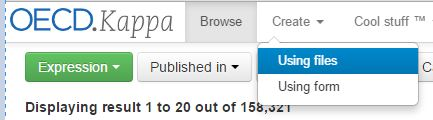
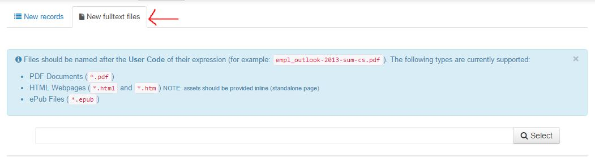

How to load the Full Text Item of a working paper
==================================================

The full text item can either be attached via the detailed page of the working paper (if you proceed one by one) or by batch loading

Load on file using the User interface
--------------------------------------

In this case the naming of the file is not relevant because the application knows to which object the FTI file is attached.

In the Detailed page of the Working paper select ``Load File``

Search you file, select it and load it

Batch Loading of FTIs
----------------------

If you need to load a bacth of FTIs you should proceed differently.

Your files need to follow a special naming convention so the application will know to which record the FTI is attached

The file naming convention for Working papers is :

``[ISSN parent series][Volume][IssueNumber][continuousNumber]-[language]``

..note:: The Record of the corresponding working paper needs to exist in the database

From the creation Tab select ``Create using files``

The select the second Tab ``New Full Text files``

