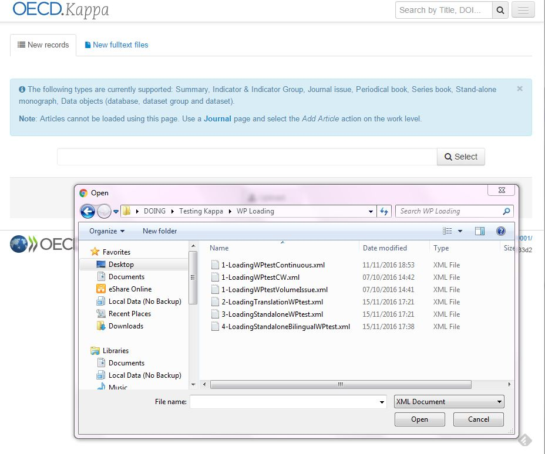
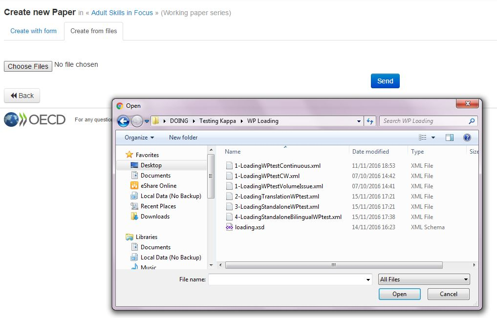

XML Loading Process for working papers
======================================

To create a working paper with an XML file you can proceed in two ways :

1) From the Home page via the ``Create using files button``

.. image:: images/CreatUsingFiles.JPG

then select and batch load the metadata XMLs

2) From the Detailed page of the series vi ``Add Paper`` button selecting ``Using Files``

Batch loading Use Cases
-------------------------

The schema contains all the necessary metadata to create a working paper pyramid, 
with a work one or several expression, one or several manifestations.

It is implied that the working paper series already exists in the database
The Working paper is directly attached to a series via the ISSN

The use cases are the following :

	- creation of a "normal" working paper from an xml containing the master language (plus eventually all the language versions)
	- creation of a second language version of an existing working paper
	- creation of a "standalone translation" working paper (not attached to the series but isTranslationOf another paper)

The following metadata are inherited from the parent working paper series
--------------------------------------------------------------------------

IGO
theme
directorate
main theme if it is not present in the XML
webtopic if it is not present in the XML
Form
publisher
distributor
iLIbrary access mode

The following metadata should be mapped from the XML file
----------------------------------------------------------

+------------------+-------+------+--------------------+-------------------------------------------------------------+
| Loading XML      | level | card | Kappa XML metadata | Comments/examples                                           |
+==================+=======+======+====================+=============================================================+
| issn             | M     | 0-1  | hasPaper xlink     | ISSN of the parent series,used to create the xlink HasPaper |
+------------------+-------+------+--------------------+-------------------------------------------------------------+
| isTranslationOf  | W     | 0-1  | workRidType        | workid of the language version in Kappa                     |
+------------------+-------+------+--------------------+-------------------------------------------------------------+
| author           | W     | 1    | author             | person:1688 or organization:9612                            |
+------------------+-------+------+--------------------+-------------------------------------------------------------+
| affiliation      | W     | 0-1  | affiliation        | organization:9612                                           |
+------------------+-------+------+--------------------+-------------------------------------------------------------+
| theme            | W     | 0-3  | mainTheme          | theme:30 (OECD) or theme:disarmament (UN)                   |
+------------------+-------+------+--------------------+-------------------------------------------------------------+
| webtopic         | W     | 0-3  | webtopic           |                                                             |
+------------------+-------+------+--------------------+-------------------------------------------------------------+
| country          | W     | 0-n  | country            | country:aus                                                 |
+------------------+-------+------+--------------------+-------------------------------------------------------------+
| region           | W     | 0-n  | region             | region:africa                                               |
+------------------+-------+------+--------------------+-------------------------------------------------------------+
| volume           | W     | 0-1  | volume             | 2016  numbering is either 2016/1 or 165                     |
+------------------+-------+------+--------------------+-------------------------------------------------------------+
| issueNumber      | W     | 0-1  | issueNumber        | 3                                                           |
+------------------+-------+------+--------------------+-------------------------------------------------------------+
| continuousNumber | W     | 0-1  | number             |  165  numbering is either 2016/1 or 165                     |
+------------------+-------+------+--------------------+-------------------------------------------------------------+
| generateCover    | W     | 0-1  | generateCover      |  yes/no                                                     |
+------------------+-------+------+--------------------+-------------------------------------------------------------+
| jelCode          | W     | 0-n  | JELCode            |                                                             |
+------------------+-------+------+--------------------+-------------------------------------------------------------+
| version          | E     | 1-n  |                    | one version per expression                                  |
+------------------+-------+------+--------------------+-------------------------------------------------------------+
| language         | E     | 1-n  | language           |                                                             |
+------------------+-------+------+--------------------+-------------------------------------------------------------+
| doi              | E     | 0-1  | doi                |  dois suffix                                                |
+------------------+-------+------+--------------------+-------------------------------------------------------------+
| keyword          | E     | 0-n  | keyword            |                                                             |
+---------------------------+---------+--------+------------------------+--------------------------------------------+
| title            | E     | 1    | title              |                                                             |
+------------------+-------+------+--------------------+-------------------------------------------------------------+
| abstract         | E     | 0-1  | abstract           |                                                             |
+------------------+-------+------+--------------------+-------------------------------------------------------------+
| format           | M     | 1-n  | format             | one format per manifestation                                |
+------------------+-------+------+--------------------+-------------------------------------------------------------+
| availability     | M     | 0-1  | availability       |                                                             |
+------------------+-------+------+--------------------+-------------------------------------------------------------+
| publicationDate  | M     | 0-1  | publicationDate    |                                                             |
+------------------+-------+------+--------------------+-------------------------------------------------------------+
| filename         | M     | 0-1  | filename           | to associate the correct file when loading the item         |
+------------------+-------+------+--------------------+-------------------------------------------------------------+
| medium           | M     | 1    | medium             |                                                             |
+------------------+-------+------+--------------------+-------------------------------------------------------------+
| numberOfPages    | M     | 1    | pageNumber         |                                                             |
+------------------+-------+------+--------------------+-------------------------------------------------------------+

Use Case 1 : creation of a normal working paper from an xml containing at least the master language
---------------------------------------------------------------------------------------------------

* The XML contains all the data to create the work, plus one expression per ``version`` element
* the element ``issn`` is used to make the link with the parent Working paper series
* the element ``isTranslationOf`` is not present

The result of the loading is the whole pyramid

Use Case 2 : creation of a second language version of an existing working paper
----------------------------------------------------------------------------------

The XML contains all the data to create one expression and attach it to the existing Working paper work
- the element ``issn`` is used to make the link with the parent Working paper series
- the element ``isTranslationOf`` indicates the workID of the master language working paper to which this version is attached

Use Case 3 : creation of a "standalone translation" working paper (not attached to the series but isTranslationOf another paper)
----------------------------------------------------------------------------------------------------------------------------------

The XML contains all the data to create one expression and attach it to the existing Working paper work

- the element ``issn`` is not present because this paper does not belong to the series
- the element ``isTranslationOf`` indicates the workID of the master language working paper to which this version is attached