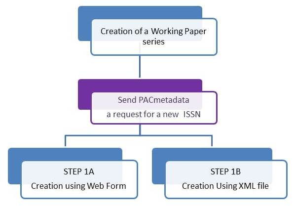

Working Papers specific rules and cataloguing guidelines
==========================================================

How to create a Working Paper Series
--------------------------------------

Most of the time you will receive a working paper to attach to an existing series, but sometimes
a new series is necessary.

When the Editorial agreement to create a new series is in place, the first step of the process will be to **contact PAC Metadata to request an ISSN**.

The submission process to the ISSN authority can take some time, please take this into account for the time to market of the new series.
While waiting for the ISSN centre to respond, you can proceed to the creation of the record in Kappa.

You will be able to save your record without the ISSN, but remember that no export will take place without it.

This is the process you should follow:

STEP 1A: :doc:`WPSeriesCreation`

STEP 1B :doc:`XMLWPSeriesCreation`

How to add a Working Paper to an existing series
----------------------------------------------------

It is very important that you check upon receiving the working paper that the authors exist in the database, **24h are needed to create a new author, so please take into account this delay**
(this is a temporary situation)

.. image:: images/WPProcess.jpg

**STEP 2**: :doc:`WPAuthors`

**STEP 3A**: :doc:`WPAddPaper2Series`

**STEP 3B**: :doc:`WPloadingprocess`

**STEP 4**: :doc:`WPloadFTI`

Kappa Model for Working Papers: what you need to know
-------------------------------------------------------

:doc:`WPTypes`

