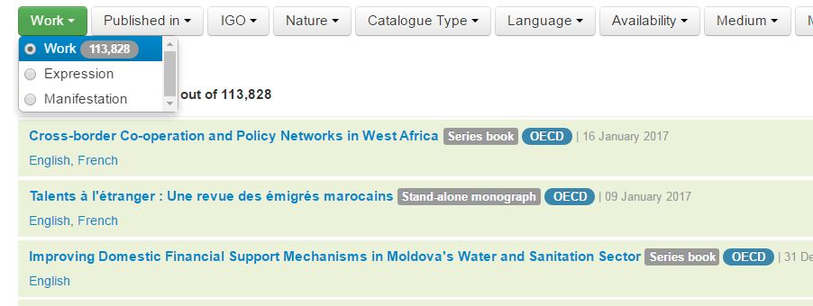
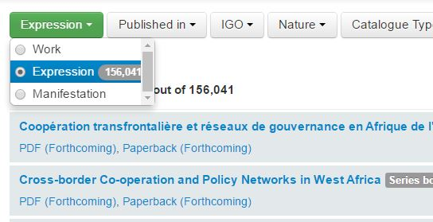
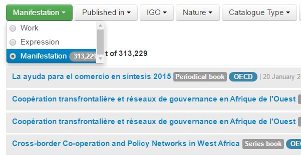
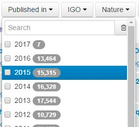
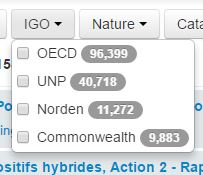
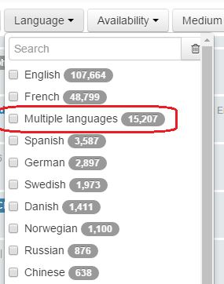
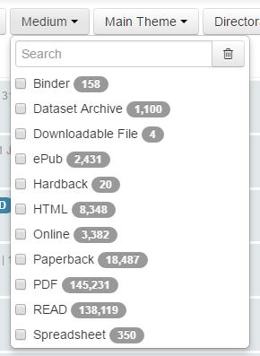
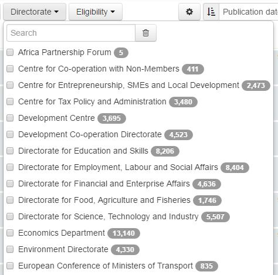

Filtering options
==================

The facets on the left side of the screen allow you to select objects with different criteria.
It is possible to select criteria across FRBR levels (for exemple select a theme which is at work level 
and an availbility status which is at manifestation level).

.. note:: Only applicable filters appear in the interface, if you do not see a filter on availability status, this means that all the objects selected have the same status and cannot be filtered with this criteria.

Work Expression or Manifestation
---------------------------------

**Filter by Work**
 
If you select Work each result will be a distinct intellectual creations of the catalogue. You will see the existing language versions in the search results. 

*For example:*

**Filter by Expression**

If you select Expression each result will be a language version of a record and in the results you will see the different output formats published.

By default expression is the level shown in the home page bcause it is the most common level consulted (corresponds to the iLibrary page level
containing a language version with all its output formats).

*For example:*

In this example of search result by work you can see that the summaries exist in three formats (HTML, PDF and ePub)

**Filter by Manifestation**

If you select manifestation each result will represent a different format of a published item and in the results you will see its availability status 

.. note:: The backgroung colour indicates at which level you are searching. You will see the same background colour in the detailed pages of each record (green for work, blue for expression and grey for manifestation).

Date of publication
--------------------

You can select one or more years of publication. By default all years are shown.

The publication date is different by format (a PDF can be published earlier than the paperback version for example).

It is therefore a metadata at manifestation level.

IGO
----

Kappa contains publication of different IGOs. 

Make sure you select the IGO which interests you using the IGO facet. By default all IGOs are shown.

Work type and catalogue type 
-----------------------------

Work types and catalogue types are two of the most used filters (see :doc:`BibliographicModel` for a description)

.. image:: images/WorkCatalogue.JPG

Work types are in bold and group the catalogue type. If you click on the work type, all the corresponding catalogue types will be selected.

Language
--------

You can filter objects by language with the corresponding facet

.. Warning:: The facet does not separate monolingual from multilingual expressions. A publication in Japanese and German will appear each time you select of the languages it contains (selecting ``multiple languages`` but also selecting ``Japanese`` and ``German``)

The languages are added up when you select more than one facet. If you select ``Russian`` and ``Arabic`` you will obtain all the publications which contein Russian AND all the publications which contain Arabic, 
not those which are in bot Russian and Arabic.

.. Warning:: A consequence of this limitation is that the interface does not allow a query like:  ``how many multilingual publications contain French?`` .  If you select ``multiple languages`` you will see all the expressions with more than one language, but you will not be able to filter them selecting ``French`` to obtain only those containing this language.

Availability status
--------------------

A new simplified status taxonomy has been put in place to separate commercial from bibliographic availability. A Kappa object will no longer be ``available``, but it will be ``published``
The list of values is now the following :

 .. image:: images/8_2-img1.png

Medium
-------

The medium taxonomy contains the following values :

* **PDF** : corresponds to ``E = E-book`` in Kappa V2
* **ePub** : corresponds to ``F = ePub`` in Kappa V2
* **HTML** : corresponds to ``K = WebBook`` in Kappa V2
* **Spreadsheet** : corresponds to ``X = spreadsheet`` in Kappa V2
* **Online** : ``W = Online`` in Kappa V2used for Periodicals, Series and Collections as well as for objects with a URL as a manifestation (indicators or branded views for example)
* **Dataset Archive** : Special medium introduced to cater for .zip files of dataset archives (and it should only be used for dataset Archives because the export rules are very specific)
* **Downloadable File** : corresponds to ``B = downloadable file`` in Kappa V2
* A list of values which corresponded to the ``P = Print`` medium in Kappa V2
	* **Binder** 
	* **Hardback** 
	* **Paperback** 

* READ : which is now a medium (see :doc:`Links`)

Main Theme
-----------

You can search publication by main theme

.. image:: images/mainTheme.JPG

.. Note:: Themes can be different by ``IGO``, if no ``IGO`` is selected, the themes will all be mixed up and presented in the same list, to make sure you have the right applicable list, please select the ``IGO`` first

Directorate
-----------

You can search publication by OECD Directorate

.. Note:: The metadata ``Directorate`` only applies to OECD publications, for other IGOs, the value is ``NA = Not applicable``

